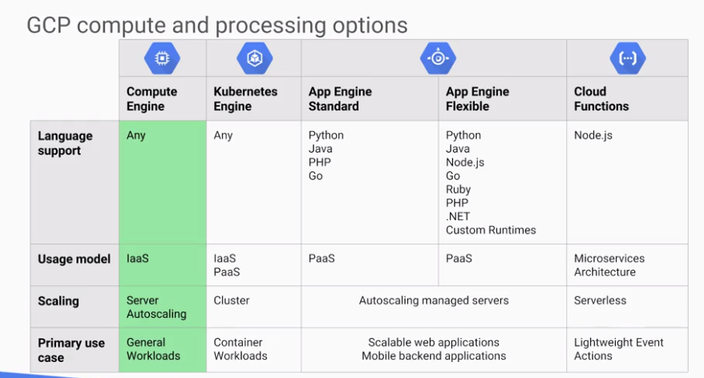
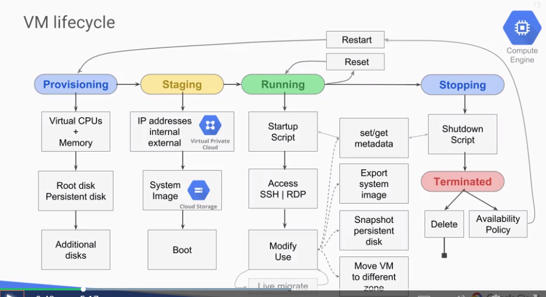
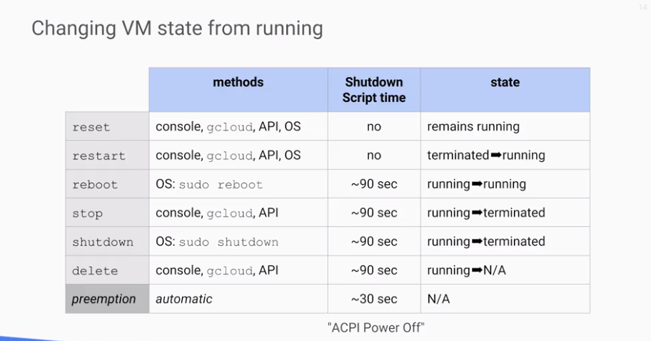
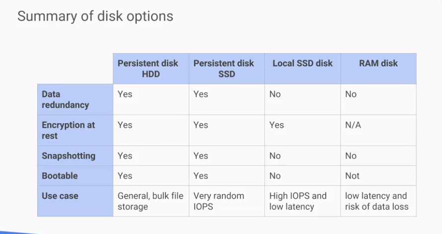
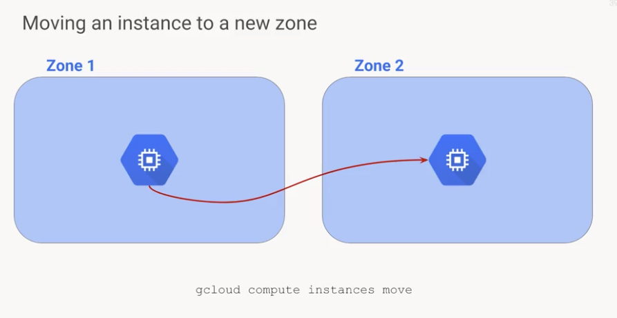
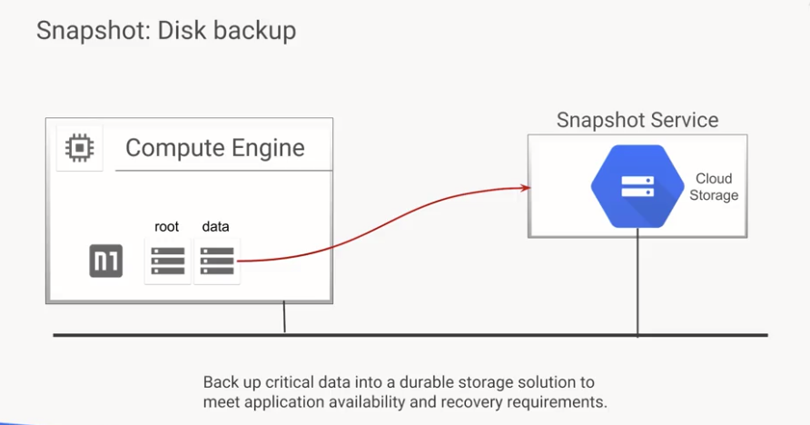
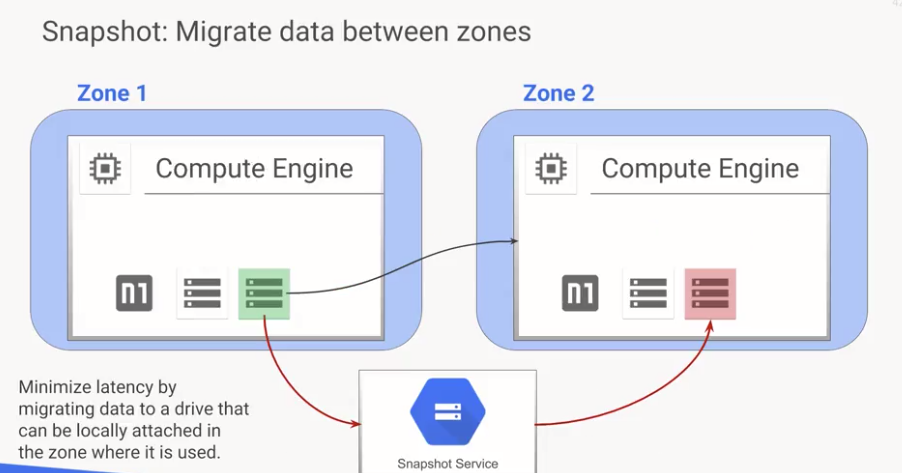
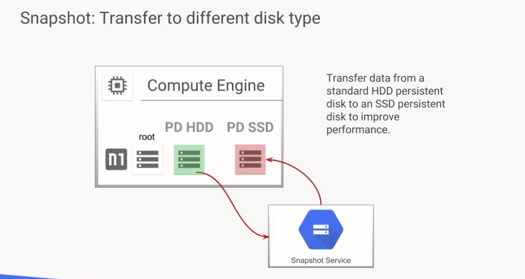

# GCP
- managed services and product offerings
- managed control (compute engine) or abstraction (app engine)

### in this course
- how to interect with GCP (console, shell, api, SDKs)
- networking
  - google cloud network is single flat network integrated with autoscalers, load balancers, routers, firewalls, etc
- virtual machines
  - how they work in cloud env
  - customization
  - per sec billing
- combining all into productive infrastructure
 
# GCP infrastructure
- ecosystem consisting of open-source software, providers, partners, developers, 3rd party software, other cloud providers
- cloud consists of Chrome, google devices, maps, gmail, google analytics, G Suite, search and GCP
- cloud infrastucture
  - Foundation
    - introduction to GCP
    - Virtual Private Cloud Networking
    - Virtual Machines
  - Scaling and Automation
    - interconnecting Networks
    - load balancing
    - autoscaling
    - infrastructure automation with Cloud API
    - infrastrcuture Automation w/ deployment manager
    - managed Services
  - Core Services
    - Cloud IAM
    - Data Storage Services
    - Resource Management
    - Resource Monitoring
  - Containers and Services
    - Application Infrastructure Services
    - application development services
    - containers 
    
# Using GCP
- GCP console
  - web-based GUI accessed through console.cloud.google.com
- SDK 
  - provides gcloud command-line tool
  - also provides Cloud Shell
    - browser based interactive shell env
    - access from console
    - temp vm w 5 gb or persistent disk storage w SDK pre-installed
    - top level commands:
      - gcloud: work w/ compute engine
      - gsutil: work w/ cloud storage
      - kubectl: work w/ Google container engine and kubernetes
      - bq: BigQuery
 - client libraries
   - easily create and manage resources
   - App APIs
     - access to  services, optimized for supported languages (ex: NodeJS, Python)
   - admin APIs
     - functionality for resource management
     
# Virtual Networks

### Virtual Private Cloud (VPC)
  - allows you to provision GCP resources, connect them to each other, isolate them from one another
  - define fine grained networking policies
  - comprehensive set of managed networking objects
  - projects encompass services
  - networks come in 3 diff flavors:
    - default
    - auto mode
    - custom mode
  - subnetworks: divide/segregate env
  - regions/zones represent data centers, provide continous data protection / high availablilty
  - providers internal/external IP addresses, granular IP ranges
  
# Projects, Networks, Subnetworks

### projects
- key organizer of infrastructure resources
- associates objects and services w/ billing
- usually contain entire networks (<=5/project)
- no ip-ranges, simple construct of all individual ip addresses, or services that are w/in that network

### networks
- no ip range
  - so subnetworks dont need to fit into address hierarchy
- global, spans all regions
- can segregate resources w/in network -> subnetworks
- 3 diff types of networks
  - default
  - auto mode
    - can be converted to custom mode
  - custom mode
    - can not be converted to anything else
- Aias IP ranges
    - assign range of internal IP address as aliases to vms primary network interface
    - useful if you have multiple services running on VM and want to assign each service a diff IP address
    - configure multiple IP addresses representing containers or apps hosted on a VM w/out having to define separate network interface
     
### subnetworks
- can extand across zones w/in same region
- subnet = iprange, can carve up ip address w/in that range
  - (10.0.0.1 reserved for router address)
  - (10.0.0.255 reserved for broadcast address)
- single firewall rule will apply to VMs in subnet

# IP Addresses
- each vm can get two ip addresses
    - internal
        - assigned via DHCP internally
        - DHCP lease renewed every 24 hours
        - VM name + IP is registered w/ network-scoped DNS
        - each instance has hostname that can be resolved to internal IP address
            - hostname = instance name
            - fully qualified domain name (FQDN) is [hostname].c.[project-id].internal
        - if instance is deleted and recreated, internal IP address can change
        - name resolution is handled by internal DNS resolver
            - provided as part of compute engine
            - configured for use on instance via DHCP
            - provides answer for internal and external addresses
    - external IP
        - allows connections to hosts outside project
            -public DNS records point to instances not published automatically
                - admins can publish these using existing DNS servers
                - can be hosted using Google Cloud DNS 
        - assigned from pool (ephemeral) or
        - reserved (static)
            - billed even when not attached to a running VM
        - vm doesnt know external IP; it is mapped to the internal IP by VPC
- network stores look up table that matched external IP address w/ internal IP address of relevant instance

# routes and rules
- route is mapping of IP range to a destination
- every network has:
    - routes that let instances in a network send traffic directly to each other.
    - default route that directs packets to destinations that are outside the network
- the fact that a packet has a route to a destination doesnt mean it can get there; firewall rules must also all the packet
- default network has preconfigured firewall rules that allow instances in network to communicate
    - manually created networks do not
        - must be created
-routes map traffic to destination networks
    - destination in CIDR notation
    - applies to traffic egressing a VM
    - forwards traffic to most specific route
    - traffic is delivered only if it also matches a firewall rule
    - created when a network orsubnet is created
    - applies to tagged VMS or all VMS
    - enables VMs on same subnet to communicate
- firewall rules protect you VM instances from unapproved connections
    - every VPC network also functions as a distributed firewall
    - firewall rules are applied to the network as a whole
    - connections are allowed or denied at the instance level
- express desired firewall config as set of firewall rules
    - firewall rule composed of following parameters:
        - direction
            - inbound connections are matched against ingress rules only
            - outbound connections are matched against egress rules only
        - source or destination
            - for ingress direction, sources can be specified as part of the rule with IP addresses, source tags, or a source service account
            - egress direction, destinations specified as part of the rule with one or more ranges of IP addresses
        - protocol and port
            - any rule can be restricted to apply to specific protocols only for specific combos of protocols and ports only
        - action
            - to allow or deny packets that match the direction, protocol, port, & source or dest of the rule
        - priority
            - governs order in which rules are evaluated: first matching rule is applied
        -  rule assignment
            - all rules assigned to all instances, but you can assign certain rules to certain instances only

# Billing
- charges (interal ips addresses, diff charges for external ips)
    - no charge
        - ingress
        - egress to same zone
        - egress to a different GCP service w/in the same region
        - egress to Google Products;  from a VM in GCP w/ public or private IP addresses
    - $0.01
        - egress between zones in the same region (per GB)
        - egress between regions w/in the US (per GB)
    - at intenet egress rates
        - egress between regions, not including traffic between US regions
- things to consider
    - VPC throughput and round-trip latency between VMs
        - varies with location
        - consider requitements
        - see docs for current specifics
    - VPC is constantly evolving
        - any feature marked BETA has no service level agreement
        - for more info, see SLA for specific feature
        
# Common Network Designs
- what has been gone over:
    - projects, networks, subnets, regions, zones
        - provide rich set of alternatvies for managing groups of resources with varying availability and access control requirements
- senerios
    - availability
        - use single subnetwork different zones
            - improved availability w/out additional security zones
    - globalization
        - one project, one network, multiple regions, multiple zones, two subnetworks
            - increased availability through globalization, subnetworks cannot span regions
    - cross-project VPC network peering
        - multiple projects, multiple networks, multiple regions, multiple zones, multiple subnetworks
            - sharing enables collaboration between parts, while isolation prevents the compromise of one part from spreading to other parts
    - Management separation
        - multiple projects, multiple networks, single region, single zone, multiple subnetworks
            - separate projects means more fine-grained access control     
    - bastion host isolation
        - what and use:
            - provide an external face and point of entry into a network containing private network instances
            - host can provide a single point of fortification or audit and can be started and stopped to enable or disabled inbound SSH communication from the internet
        - instance used as jump host
            - external connections via SSH, used to connect to internal instances
        - be sure to harden bastion host
            - limit CIDR range of source IPs connecting to bastion
            - firewall rules allow SSH traffic to private instances only from bastion
    - NAT gateway host isolation
        - instance 1 has no external IP address and is tagged to match the route
        - instance 2 is configured as a NAT gateway with IP forwarding
        - instance 1 communicates with instance 3 via gateway
        - note: Networks 1 and 2 could be in the same or separate projects
        
# VMS Overview
- most common infrastucture component
- powered by compute engine
- consist of virtual CPU, some memory, disk storage, and IP address
- offers some things that can't exist on hardwar
    - can share cpu, less capacity for lower cost
    - some vms offer burst capability
        - virtual CPU can above its rated capacity for brief period using available shared physical CPU
        
# Compute Engine

- gives most flexability
- infrastucture as a service model
- you handle autoscaling and other aspects
- for general workload especially enterprise apps designed to run on server infrastructure
- predefined and custom machine types
    - custom
        - how much CPU
        - storage (hard drives, SSDs, local SSDs, or mix)
        - configure networking
        - run combo of linux and windows machines
- Compute options
    - many machine types: high CPU, high memory, standard, and shared-core machine types
        - network throughput scales at GB per vCPU
        - max throughput of 16Gb or 8 vCPU
    - vCPU is equal to 1 hyperthreaded core
    - 2 vCPU is equal to 1 physical core
- Storage options
    - persistent disks:
        - standard, SSD, or local SSD
        - standard and SSD PDs scale in performance for each GB of space allocated
    - resize disks, migrate instances with no downtime  
    - create instances with up to 8 separate 375 gb local SSD partitions       
    - standard and nonlocal SSD up to 64 TBs for each instance
- compute resources networking
    - robust networking features
        - default, custom networks
        - inbound/outbount firewall rules
            - IP based
            - instance/group tags
        - regional HTTPS load balancing
        - network load balancing
            - does not require pre-warming
        - global and multi-regional subnetworks
        
### Pricing and Discounts
- per second billing, sustained use discounts
    - 1 min minimum
- preemptible instances
    - live at most 24 hours
    - can be pre-empted with 30 sec notification via API
    - up to 80% discount
- custom machine types
    - customize amount of memory and CPU
- recommendation engine
    - notifies you of underutilized instances
- scaled discounts for sustained use
- committed use discounts
- always free usage quotas
- inferred instances:
    - the same type of machine used in the same zone will be combined into single charge as if 1 machine in use whole time, most discounts
    
# VM access and lifecycle
### VM access
creater of instance has full root privileges on that instance
- linux: SSH
    - ssh from console, ssh from cloudShell via Cloud SDK
    - ssh from computer, third-party client and generate key pair
    - requires firewall rult to allow tcp:22
- Windows: RDP
    - requires setting windows password
    - requires firewall rule to allow tcp:3389
    - RDP clients
        - Chrome extension, third-party aps, MS Windows RDP client
        - linux freerdp, remmina
    - powershell terminal
    
### VM lifecycle

- Availability Policy: Automatic changes
    - called "scheduling options" in SDK/API
    - automatic restart
        - automatic CM restart due to crash or maintenance event
            - not preemption or a user initiated terminate
    - on host maintenance
        - determines whether host is live-migrated or terminated due to a maintenance event. Live migration is default
    - live migration
        - durint maintenance event, VM migrated to diff hardware w/o interruption
        - metadata indicates occurrence of live migration
### Stopped (teminated) VM
- note: you dont have to stop a VM to make many of these changes, however, these are the actions that you can make to stopped VM
- no charge for stopped VM
    - still charged for attached disks and IPs
- Actions
    - change the machine type
    - add or remove attached disks; change auto-delete settings
    - modify instance tags
    - modify custom VM or project-wide metadata
    - remove or set a new static IP
    - modify VM availability policy
    - Can't change the image of a stopped VM
    
# Working with Virtual Machines
### Compute options
- choosing region and zone
    - geographical location you wnat to run resources
    - new hardware architecture deployments not available in all zones
        - diff cpu architectures in diff szone
        - up to 3 gens difference between zones 
        - billing same for all equivilent architectures
- custom machines
    - can customize CPU memory and GPU needs
    - generally more expensivem but more flexibility
        - discounts
            - sustained use, 
### Images
- whats in an image
    - contents of an image
        - boot loader
        - operating system
        - file system structure
        - software
        - cusomizations
    - image storage
        - A tar and gzip'd file
        - In a private area of cloud storage managed by the image service 
- public base images
    - google, third-party vendors, and community; premium images (p)
    - linux
        - centOS, CoreOS, Debian, RHEL(p), SUSE (p), Ubuntu, openSUSE, and FreeBSD
    - Windows
        - Windows Server 2016 (p), 2012-r2(p), 2008-r2(p)
        - SQL Server pre0installed on Windows(p)
- custom images
    - create new image from VM: pre-configured and installed SW
    - Import from on-prem, workstation, or another cloud
    - management features: image sharing, image family, deprecation 
    
### Disk Options
- boot disk
    - vm comes w single root persistent disk
    - image is loaded onto root disk during first boot
        - bootable: you can attach to a vm and boot from it
        - durable: can survive VM terminate
    - some OS images are customized for Compute engine
    - can survive the VM deletion if "Delete boot disk when instance is deleted" is disabled
###### Persistant disks
- network storage appearing as a block device
    - attached to a VM through the network interface
    - durable storage: can survive VM terminate
    - bounded to zone: coannot be moved between zones
    - bootable: you can attach to a VM and boot from it
    - snapshots: incremental backups
- Features
    - HDD (magnetic) or SSD (faster, solid-state) options
    - Disk resizing: even running on attached!
    - can be attached in read-only mode to multiple VMs
    - checksums build-it; Automatic encryption - your key optional
    - [performance](https://cloud.google.com/compute/docs/disks/performance)
    
###### Local SSD disks
- Physically attached to VM - not available on shared core
    - more IOPS, lower latency, higher throughput, than persistent disk
    - SCSI or NVMe interface
        - NVME requires and NVMe-enabled image
        - NVMe is faster than SCSI
- 375-GB disk up to 8
- up to 680 K read IOPS and up to 360K write IOPS
- Data survives a reset, but not a VM stop or terminate
    - VM-specific cannot be reattached to a diff VM
- can use your own encryption keys

###### RAM disk
- tmpfs
- faster than local disk, slower than memory
    - use when your application expects a file system structure and cannot directly store its data in memory
    - fast scratch disk or fast cache
- very volatile - erase on stop or restart
- may need a larger machine type if RAM was sized for the application
- consider using a persistent disk to back up RAM disk data

- persistent disk management differences
    - cloud persistent disk
        - single file system is bets
        - resize (grow) disks
        - resize filesystem
        - built-in redundancy
            - built-in snapshot service
        - automatic encryption prior to write - use your keys
    - Computer hardware disk
        - partitioning
        - repartition disk
        - reformat
        - redundant disk arrays
        - subvolume management and snapshot
        - encrypt files before write to disk
        
### Common Compute Engine Actions

- moving an instance to a new zone
    - automated process (moving within region)
        - `gcloud compute instances move`
        - update references to VM, not automatic
    - manual process (moving between regions):
        - snapshot all persistent disks on the source VM
        - create new persistent disks in dest zone restored from snapshots
        - create new VM in the dest zone and attach new persistent disks
        - assign static IP to new VM
        - update references to VM
        - Delete the snapshots, original disks, original vm
        
###### snapshots

- persistant disk snapshots
    - snapshot not available for local SSD
    - creates incremental backup to cloud storage
        - not visible in your buckets - managed by the snapshot service
        - consider cron jobs for periodic incremental backup
    - snapshots can be restored to new persistent disk
        - new disk can be in another region or zone in the same project
        - basis of VM migration: "moving" a VM to a new zone
            - snapshot doesn't backup VM metadata, tags, etc.
- snapshot disk prep
    - boot disk, halt the system
        - `sudo shutdown -h now`
    - additional disk, unmount the file system
        - `sudo unmount </mount/point>`
        - if unmount isnt possible:
            - stop apps from writing to the persistent disk
            - complete pending writes and flush cache
                - `sudo sync`
            - suspend writing to the disk device
                - `sudo fsfreeze -f </mount/point>`
###### resize persistent disk
- improve I/O performance by increasing storage capacity of a persistant disk
- can edit persistent disk, increase size, increase IOPS capacity
- a disk can be resized even when it is attached to VM while it is running
- dont need to use a snapshot to accomplish this
- can grow disks but never shrink them

            
            
         

     

