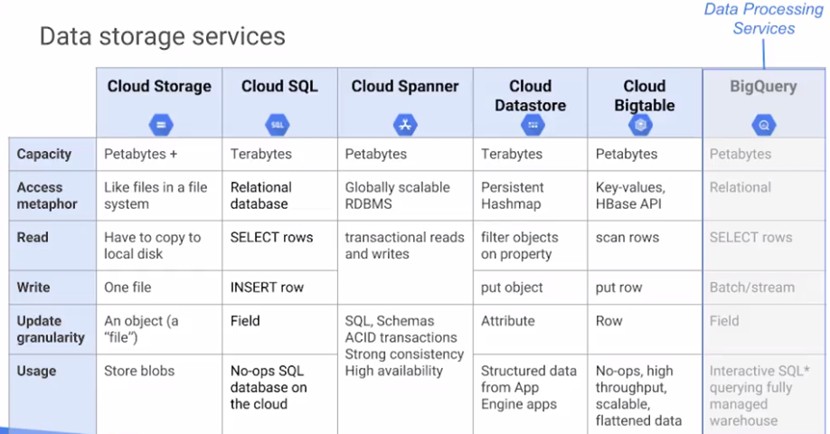
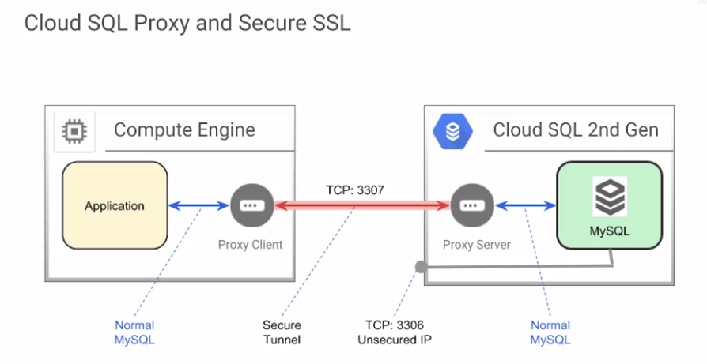
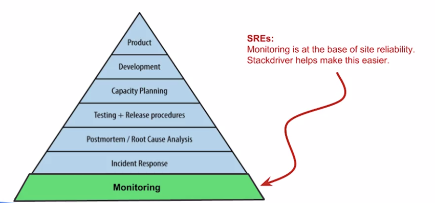

# Cloud Identity and Access Management (IAM)
- who can do what on which resource
    - who
        - person, group or application
    - what
        - specific priviledges or actions
- Cloud IAM objects
    - Organization
    - Folders
    - Projects
    - Members
    - Roles
    - Resources
    - Products
    - G Suite Super Admins
- resource Hierarchy
    - a policy is set on a resource and each policy contains a set of:
        - roles
        - role members
    - resources inherit policies from parent:
        - resources policies are a union of parent and resource
    - if parent policy is less restictive, it overrides a more restrictive resource policy
    

- best practice to follow the principle of least privilege
    - applies to identities, roles and resources
    - always select smallest scope that necessary to reduce exposure to risk

### Organization
- Organization Node
    - root node for GC resoureces
    - organization roles:
        - organization admin:
            - control over all cloud resources; useful for auditing
        - project creater:
            - controls project creation; control over who can create projects
- organization
    - created by Google Sales
    - org owners are established at creation
        - G Suite super admins are the only organization owners
    - org owner:
        - assigns org administrator role from the G Suite Admin console - (Admin is a seperate product)
            - organization administrators manage GCP from the Cloud Console
        - always have more than on org owner, for security purposes
- folders (can be seen as sub-organization)
    - additional grouping mechanism and isolation boundaries between projects:
        - different legal entities
        - departments
        - teams
    - allow delegation of administration rights
    
- resource manager roles
    - organization
        - admin: full control over all resources
        - viewer: view access to all resources
    - folder
        - admin: full control over folders
        - creator: browse hierarchy and create folders
        - viewer: view folders and projects below a resource
- project
    - creator: create new projects (automatic owner) and migrate new projects into organization
    - deleter: delete projects
- GPC Authorization
    - use googles credential system
        - manage accounts using Google G Suite
        - sync existing credentials using google cloud directory sync
        - optionally implement single sign-on (sso)
    - built-in features
        - session activity tracking
        - session management tools
        - security alerts
        - suspicious activity detection
- Google Cloud Directory Sync (GCDS) (G Suite)
    - synchronizes G Suite accounts to match the user data in existing LDAP or MS Active Directory
        - syncs groups and memberships, not content or settings
        - supports sophisticated rules for custom mapping of users, groups, non-employee contacts, user profiles, aliases, and exceptions
    - one-way synchronization from LDAP to directory
        - administer in LDAP, then periodically update to G Suite
    - runs as utitlity in server environment
- Single sign-on (SSO)
    - use your own authentication mech and manage you own creds
    - federate your ids to GCP
    - users do not have to sign in a second time to access GCP resources
    - revoke access to GCP using your existing credential managment
- setting up SSO
    - if existing auth supports SAML2, SSO config is 3 links and a cert
        - if not supported, use 3rd party solution
- Cloud IAM best practices
    - priciple of least privilege
        - always apply minimal access level requited
    - use groups
        - if group membership is secure, assign roles to groups and let the G Suite Admins handle membership
            - always maintain and alternate
            - for high risk areas assign roles to individuals directly and forego the convenience of group assignment
    - control who can change policies and group memberships
    - audit policy changes
        - audit logs record project-level permission changes
        - additional levels are being added

### Roles
- define can do what on which resource
- group of permissions
    - represent abstract functions
    - customize roles to align with real jobs
- permissions are classes and methods in the APIs
    - `<service>.<resources>.<verb>`
    - usually (but not always) 1:1 with REST API
- Roles can be customized BETA
- primitive roles
    - a project can have multiple owneers, editors, viewers and billing admins
    - owner
        - invite members
        - remove members
        - delete project
        - includes editor rights
    - editor
        - deploy apps
        - modify code
        - configure services
        - includes viewer rights
    - viewer
        - read-only acces
    - billing admin
        - manage billing
        - add admins
        - remove admins
- curated roles
    - give granular access to specific GCP resources and prevent unwanted access to other resources

- custom roles
    - in beta
- Essential Roles
    - organization roles
    - folder roles
    - project roles
    - product-specific roles
        - crafted for each resource/product (20+)
        - product specific Cloud IAM documentation
        - some in beta
        
###### project roles
- mimic primitive roles
    - viewer
        - read only actions that do not modify state
        - browser role (BETA) - only "info about" (metadata)
    - editor
        - viewer + actions that modify state
    - owner
        - editor + manage access control for a project and all its resources
        - editor + set up project billing
        - invite others to be owners
        
###### product specific roles
- roles crafted for each product - read Cloud IAM doc
- example: compute engine roles
    - compute engine instance admin
    - service account user
    - compute engine image user
    - compute engine network viewer
    - etc
    
### Members
- users
    - google accounts: @gmail, @google
    - G Suite domains: Google-hosted domains (mydomain.com)
    - google groups (groupname@mydomain.com)
    - GCP does not create or manage users or groups
        - G Suite admin Super administrator manages users and groups for an org. "G Suite Admin" is separate product form GCP
- Service Accounts
    - created and managed in GCP
    
### Service Accounts
- provide an identity for carrying out server-to-server interaction in a project w/o supplying user credentials
- used to authenticate from one service to another:
    - programs running w/in Compute Engine instances can automatically acquite access tokens with credentials
    - token used to access any service API in your project and any other services that granted access to that service account
    - convenient when not accessing user data
- identified by an email address
    - ex: `12384567896-compute@project.gserviceaccount.com`
- three types of service accounts
    - user-created (custom)
    - built-in
        - compute engine and app engine default service accounts
    - google APIs service account
        - runs internal google processes on your behalf
###### Default Compute Engine service account
- automatically created per project w/ auto-generated name and email address:
    - name has -compute suffix (see example above)
- automatically added as project editor
- by default enabled on all instances created using gcloud or GCP Console
    - override by specifying another service account or by disabling service accounts for the instance
- support primitive(project) and curated (Cloud IAM roles)
    - user-created service accounts use Cloud IAM roles only
###### Scopes
- used to determine if authenticated identity is authorized

- access token can be given for specified time frames
- customizing scopes for a VM
    - you can create an instance with customized scopes for your use case using the default service account.
        - scopes can be changed after an instance is created
    - for user-created service accounts, use Cloud IAM roles instead
###### Service accounts and keys
- service accounts authenticate with keys
    - Google manages keys and key rotation for compute engine and app engine
    - alternatively, create, manage and rotate keys yourself

### Cloud IAM best practices
- resource hierarchy
    - use projects to group resources that share the same trust boundary
    - check the policy granted on each resource and make sure you understand the inheritance
    - use "principle of least privilege" when granting roles
    - audit policies in cloud audit logs: `setiampolicy`
    - audit membership of groups used in policies
- groups
    - grant roles to google groups instead of individuals:
        - update group membership instead of changing cloud IAM policy
        - Audit membership of groups used in policies
        - control the ownership of the Google Group used in Cloud IAM policies
    - use multiple groups to get better control
    - Groups are not only associeated with job roles
    - Groups can exist for the purpose of role assignment    
- Service Accounts
    - be very careful granting `service AccountUser` role
    - when you create a service account, give it a display name that clearly identifies its purpose
    - establish a naming convention for service accounts
    - establish key rotation policies and methods
    - audit with `serviceAccount.keys.list()` method
- Cloud Identity-Aware Proxy (Cloud IAP)
    - establish central auth layer for apps accessed by HTTPS, so you can use app level access control model instead of relying on network-level firewalls 
    - enforce access control policies for applications and resources
        - identity-based access control
        - central auth layer for apps accessed by HTTPS
    - Cloud IAM policy is applied after auth    
    
# Data Storage Services

### Cloud Storage

- Overview
    - Buckets
        - naming requirements (globally unique)
        - cannot be nested
    - objects
        - inherit storage class of bucket when created
        - no minimum size; unlimited storage
    - Access
        - gsutil command
        - (RESTful) JSON API or XML API
- Buckets
    - changing default storage classes
        - can change the default storage class fo bucket
        - default class is applied to objects as they are created in the bucket
        - change only aggects new objects added after the change
        - regional bucket can never be changed to Multi-regional
        - multi-regional bucket can never be changed to regional
        - objects can be moved from one bucket to another bucket with the same storage class from the GCP console
            - however, moving objects to buckets of diff storage classes requires the `gsutil` command from CloudShell
        - 
- Access Control
    - 
    - Access Control Lists (ACLs)
        - predefined ACL project-private is applied by default to all new buckets and objects
        - each ACL contains 1 >= entries >= 100
        - 2 pieces of info:
            - Scope (who can perform specified actions)
                - `allUsers`
                - `allAuthenticatedUsers`
                - Google accounts
                    - individuals, groups, domains
                - Cloud Storage ID
                - Project convenience values
                    - owners-[CS project ID]
                    - editors-[CS project ID]
                    - Viewers-[CS project ID]
            - Permission (what actions can be performed)
                - owner => writer => reader
    - Signed URLS
        - "valet key" access to buckets and objects via ticket:
            - cryptographically signed URL
            - time limited
            - ops specified in ticket: HTTP GET, PUT, DELETE (not POST)
            - Program can decide when or whether to give out signed URL
            - any user with URL can invoke permitted operations
        - example using private account key and gsutil:'
            - `gsutil signurl -d 10m path/to/privatekey.p12 gs://bucket/object`
        - Another example:
            - `http://google-testbucket.storage.googleapis.com/testdata.txt?
               GoogleAccessId=123456980123.developer.gserviceaccount.com&Expires=1331155464&
               Signature=BA234weqdsf...LoDaawer234SDFaahsejng@#$41n%3D`
            - Query parameters
                - GoogleAccessEd: Email address of the service account
                - Expires: When the signature expires in UNIX epoch
                - Signature: cryptographic hash of composite URL str
            - string that is digitally signed must contain:
                - HTTP verb (GET)
                - expiration
                - Canonical resource (/bucket/object) 
###### Cloud Storage Features
- Overview
    - Customer-supplied encyption key (CSEK)
        - use your own key instead of Google-managed keys
    - object lifecycle management
        - auto delete or achive objects
    - object versioning
        - maintain multiple versions of objects*
            - charged for versions as if individual files
    - directory syncs
        - syncs a VM directory w/ a bucket
    - object change notification
    - data import
    - strong consistency
- Object Versionsing
    - 
    - buckets with object versioning enabled maintain a history of mods (overwrite/delete) of objs
    - bucket users can list archived versions of an object, restore object to older state, delete version
    - supports conditional updates
    - can turn on or off at any time
- object lifecycle management
    - lifecycle management policies specify actions to be performed on objects that meet certain rules
    - examples include:
        - downgrade storage class on objects older than year
        - delete objects created before a specific date
        - keep only the 3 most recent versions of an object
    - object inspection occurs in asynchronous batches, so rules may not be applied immediately
    - changes to lifecycle configs can take 24 hours to apply
    - updates may take up 24 hours to go into effect
- object change notification
    - 
    - cloud storage can watch a bucket and send notifications to exteranl apps when objects change (through a web hook)
    - cloud pub/sub notifications for cloud storage is recommended way to track changes
- data import
    - storage transfer service enables high-performance imports of online data into cloud storage buckets
        - imports from another bucket, an s3 bucket or web source
        - can schedule transfers, create filters, etc
        - accessible via console or APIs
    - Googe tansfer appliance
        - enables secure transfer of up to a petabyte of data by leasing a high capacity sorage server from Google
    - Offline Media Import
        - service where physical media is sent to a third-party provider who uploads the data
- strong consistancy
    - cloud storage provides strong global consistency, including both data and metadata:
        - read-after-write
        - read-after-metadata-update
        - read-after-delete
        - bucket listing
        - object listing
        - granting access to resources    
   

### Cloud SQL 
- Overview
    - fully managed MySQL and PostgreSQL databases
        - fully manged instances
        - patches and updates auto applied
        - still have to administer MySQL users
    - Cloud SQL supports many clients
        - `gcloud beta sql`
        - App Engine, G Suite scripts
        - apps and tools
            - SQL workbench, Toad
            - External apps using Standard MySQL drivers
- Cloud SQL generations
    - second Generation (recommended)
        - up to 7x throughput and 20x storage capacity of First Generation
        - up to 208 GB or RAM and 10 TB of data storage
        - My SQL 5.6 or 5.7
        - InnoDB only
    - First Generation
        - up 16 GB or RAM and 500 GB of data storage
        - MySQL 5.5
        - IPv6 connectivity and on Demand activatyion policy
    - Some My SQL features not supported; UDFs (user defined functions)
- Cloud SQL services
    - Replica services
        - read replicas
        - failover replicas
        - external replicas
        - external master to Cloud SQL first gen replics
    - backup service
        - on demand
        - scheduled/auto
    - Auto Quiesce
    - Import/Export
        - import data to Cloud SQL
        - export data from Cloud sql
    - scaling
        - scale up (change machine capacity)
            - requires restart
        - scale out
            - via read replicas
- Connecting to cloud sql ([docs](https://cloud.google.com/sql/docs/mysql/connect-admin-ip))
    - Basic connection
        - IP address
        - add authorized network
    - secure access
        - whitelist IP addresses
        - add to authorized networks list
        - configure SSL
        - static IP
    - instance level access
    - mysql db level access
        - mysql users
        - db access
    - example:
        - 
        

### [Cloud Spanner](https://cloud.google.com/spanner/)
- combine benefits of relational database structures w non-relational horizontal scale
- Overview
    - Strong consistency
        - strongly consistent secondary indexes
        - globally consistent
    - SQL support
        - SQL (ANSI 2011 with extensions)
        - ALTER statements for schema changes
    - Managed instances
        - high availability through data replication
- comparisons
    - 
- support
    - open standards
        - Standard SQL (ANSI 2011)
        - Envryption, Audit logging, identity and access management
        - client libraries in popular languages
        - java python, go, node.js
        - jdbc driver
    - workloads
        - transactional
        - Scale-out
        - global data plane
        - database consolidation
- Architecture
    -     
    - replicates data in N cloud zones,
        - 1 region or across several
        - placement is configurable (choose which region to put db in)
        - allows high availability and global placement  
        - 
        - atomic clocks allow for atomicity when updating data
- Cloud IAM roles
    - can apply Cloud IAM roles to ind dbs
        - `spanner.admin`
        - `spanner.databaseAdmin`
        - `spanner.databaseReader`
        - `spanner.dabaseUser`
        - `spanner.viewer`
- Feature details
    - tables
        - optional parent-child relationships between tables
        - interleaving of child rows w/in parent rows on primary key
    - Primary keys and secondary keys
    - db splits
    - transactions
        - locking read-write and read-only
    - timestamp bounds
        - strong, bounded staleness, exact staleness, maximum staleness        

### [Cloud Datastore](https://cloud.google.com/datastore/)
- [DOCS](https://cloud.google.com/datastore/docs/)
- features
    - API support for several languages
    - data replicated across several data centers
    - queries scale w size of result set, not the size of data set
    - autoscale
    - schemaless access
    - sql-like capabilities
    - auth, secure sharing
    - fast and easy provisioning
    - restful endpoints
    - ACID transactions
    - local development tools
    - build-in redundancy
- data objects
    - relationships:
        - kind: category of object
        - entity: a single object
        - property: ind data for an object
        - key: unique ID
    - entity groups and ancestor queries
        - an "ancestor query" enables a strong consistency result, cersus a non-ancestor query, which yields an eventually consistent result
        - enables app devs to balance requests
- replication
    - multiple locations
        - multi-regional
            - multi-region redundancy; higher availability
        - regional locations
            - lower write latency; co-location w other resources
        - global points of presence: lower latency for the end user
    - SLA
        - regional multi-zone and multi-regional replication enable high availability w/ an SLA covering
            - 99.95% for multi-regional locations
            - 99.9% for regional locations

    

### [Cloud Bigtable](https://cloud.google.com/bigtable/)
- [DOCS](https://cloud.google.com/bigtable/docs/)

- overview
    - fully managed NoSQL db
    - Pb(petabyte)-scale w very low latency
    - seamless scalability for throughput
    - learns and adjusts to access paterns
    - ideal for storing single-keyed data for very low latency
    - excellent for big data apps
    - can be accessed via HBase extension
    - benefits over HBase
        - scales by machine count, not limited by QPS (queries by second)
        - low ops: admin tasks are auto
        - resize in secs
- structure and schema
    - noSQL, sparse wide-column database
    - single index: the row key
    - atomic single-row transactions
- overall architecture:
    - 
    - processing done through frontend server pool and nodes
        - handles sep from storage
    - table is stored in blocks of contiguous rows called tablets
    - tablets
        - help balance workload or queries
        - similar to each base regions
        - stored on Colossus (googles file system in SS table format)
        - SS table formatL
            - provides persistent ordered immutable map from keys to values (both arbitrary byte strings)
    - adjusts to specific axis patterns
        - if certain big table node is frequently accessing certain subset of data
            - will update indexes so that the other nodes can distribute that workload evenly
            - that throughput scales linearly          

# Resource Management
### Cloud Resource Manager
- heirarchically manage resources by project, folder, and org
- billing and resource monitoring
    - organization contains all billing accounts
    - project is associated with one billing account
    - project accumulates consumption of all resources
    - a resource belongs to one and only one project
    - resource belongs to one and only one project
    - resource consumption is measured on
        - rate of use/time
        - number of items
        - feature use
- projects
    - track resource and quota usage
        - enable billing
        - manage permissions and credentials
        - enable services and APIs
    - projects use 3 identifying attribs:
        - proj name
        - proj #
        - proj ID (aka: app ID)
    - GCP console or the cloud resource manager API
- resource Hierarchy
    - 
    
### Quotas
###### project quotas
- all resources are subject to project quotas or limits
    - typically gall into 1 of 3 cats:
        - how many resources you can create per project
        - how quickly you can make API requests in a project - rate limits
        - some quotas are per region
    - quota ex:
        - 5 networks / project
        - 300 admin requests per min (cloud spanner)
        - 24 cpus region/project
    - most quotas can be increased through self-service form or a support ticket
        - IAM & admin -> quotas
- why use?
    - prevent runaway consumption in case of an error or malicious attack
    - prevent billing spikes or surprises
    - forces sizing consideration and periodic review
    
### Labels and Names   
###### Labels
- a utility for organizing Google Cloud Platform resources
    - attached to resources: VM, disk, snapshot, image
    - Console, gcloud or API
- Example uses of labels:
    - search and list all resources (inventory)
    - filter resources (ex: separate production from test)
    - labels used in scripts
        - Help analyze costs
        - run bulk operations 
- label specification
    - key:value pair
    - keys and non-empty label values can contain lowercase letters, digits, and hyphens, must start w a letter and must end w a letter or digit
        - regex = `[a-z]([-a-z0-9]*[a-z0-9])`
    - max len of label keys and values is 63 chars
    - labels/resource <= 64 
- best practices
    - team or cost center
        - distinguish projects owned by diff teams
        - useful in cost accounting or budgeting
        - ex:
            - `team:marketing`
            - `team:research`
    - components
        - exs:
            - `component:redi`
            - `component:frontend`
    - environment or stage
        - ex:
            - `environment:prod`
            - `environement:test`
    - Owner or contact
        - person responsible for resources or primary contact for the resource
        - ex:
            - `owner:gaurav`
            - `contact:opm`
    - state:
        - ex:
            - `state:inuse`
            - `state:readyfordeletion`  
- comparing labels and tags
    - labels are way to organize resources across GCP
        - disks, image, snapshots...
    - user-defined strings in key:value format
    - propagated through billing
    - tags are applied to instances only
    - tags are user-defined str
    - tags are primaryily used for networking (applying firewall rules)   

### Billing             
- budgets
    - track how spend is growing towards amount
    - set budget as specific amount or match to previous months spend
    - set notifications for specific percentage
    - based on estimated, not actual expenses may be higher
- export billing
    - export to file or import to big query dataset

# Resource Monitoring

## Stackdriver
- overview
    - dynamically discovers cloud resources and app services based on deep integrations
    - integrated monitoring, logging, diagnositics
    - manages across platforms
        - GCP and AWS
        - dynamic discovery of GCP w smart defaults
        - open source agents and integrations
    - access to powerful data nd analytics tools
    - collaborations with third-party software
    - integrates 5 services
        - monitoring, logging, error reporting, fault tracing, debugging
- multiple integrated products
    - benefits of stackdriver
        - monitors multi-cloud
            - gcp and aws
        - identify trends and prevent issues
            - charts
        - reduce monitoring overhead
        - improve signal-to-noise
            - advanced alerting
        - fix problems faster
            - alerts -> dashboards -> logs
- organization
    - 
- partner integrations
    - 
    
### Monitoring
- Overview
    - dynamic config and intelligent defaults
    - platform, system, and application metrics
        - ingests data: metrics, events, metadata
        - generates insights through dashboards, charts, alerts
    - uptime/health checks
    - dashboards alerts
- Site reliability
    - site reliability engineering (SRE)
        - discipline that incorporates aspects of sofware engineering, and applies that to operations
        whos goals are to create ultra scalable and highly reliable software systems
    - 
- platform, system, and application
    - platform
        - GCP and AWS
    - System
        - hosted probes
        - gcp linux (native, minimal); linux/windows expanded (agent)
    - application instrumentation
    - common applications
    - cassandra, nginx, apache web server, elastic serach ...
- uptime check overview
    - verify availability of service by accessing it from locs around world
    - defaults to verifying from 6 global locations
    - settings
        - global check of HTTP, HTTPS, TCP
        - app engine, compute engine, urls ...
        - timeout
            - if no response in timeout, counts as failure
- monitoring agent
    - 
    - to access additional system resources and app services
    - does not currently support monitoring agent
- uptime monitoring
    - 
- groups
    - aggregate metrics across set of machines
        - dynamically defined
        - useful for high-change environments
    - separate production from development
    - filter kubernetes engine data by name and custom tags for cluster
- dashboards
    - no setup needed for GCP
    - quick visualization of core metrics for insights
    - customizable dashboards
    - auto-generated dashboards for common apps
- custom metrics
    - 
- stackdriver accounts
    - "single pane of glass"
        - monitor all lyour GCP projects in a single account
    - determine your monitoring needs up front
    - consider using separate stackdriver accounts for data and control isolation
- Alerts
    - alert on symptoms, not causes
        - ex: monitor failing queries not database down
    - use multiple channels
        - avoid a single point of failure in your alert strategy
        - multiple notification channels, email, SMS ...
    - customize alerts to audience needs
        - use descriptions to tell them what actions to take, what resources to examine
    - avoid noise
        - adjust monitoring so alerts are actionable, not dismissable 

# Logging, Error Reporting, Tracing and Debugging
### Logging
- overview
    - stackdriver logging allows you to 
        - store, search, analyze, monitor, and alert on log data
    - ploatform, system, and app logs
        - API to write to logs
        - 30 day retention + option to transfer to cloud storage
    - log search/view/filter
    - log-based metrics
    - monitoring alerts can be set on log events
    - data can be exported to BigQuery
- Viewing and exporting
    - configure sinks for export
    - stackdriver logs must have access to the resource
        - cloud storage: storage and archiving
        - BigQuery: analysis
        - Cloud Pub/Sub: software integration
    - export process:
        - as new log entries arrive, they are exported to sinks
        - existing log entries at the time the sink is created are not exported
        - cloud storage entries are batched and sent out ~ hourly
- exporting logs
    - retain data longer by exporting to different storage classes of Cloud Storage
        - stackdriver only maintains log for 30 days
    - search and analyze logs w bigquery
    - advanced visualization with cloud datalab
    - stream logs to apps or endpoint with cloud pub/sub
- best practices
    - dont user substring matches on service names or resource types
    - faster search: search for specific valuees of indexed fields
        - ex: log entrys name, resource type, resource label
    -advanced filter
        - more effectvice queries
        - add to filter directly from log entries
    - learn the advanced viewing interface
        - set up selections and filters in basic viewing interface
        - then switch to advanced interface
### error reporting
- overview
    - counts, analyzes, aggregates errors in running cloud service
    - generally available for app engine standard env and is a beta feature for app engine flexible env
    compute engine, and AWS EC2
    - aggregate and display errors for running cloud services
        - error notifications
        - error dashboard
        - java, python, javascript, ruby, c#, php and Go
### Tracing
- collects latency data from app and displays it in GCP console
- tracing system
    - displays data in new real time
    - latency reporting
    - per-URL latency sampling
- collects latency data
    - app engine
    - google HTTPS load balancers
    - applications instrumented with stackdriver Trace SDKs
### Debugging
- overview
    - inpect and app w/out stopping it or slowing it down significantly
    - app engine stadard or flexible and compute engine (and kubernetes engine)
         - compute and kubernetes engines in beta
    - java python or go
    - debug snapshots
        - capture call stack and local variables of a running app
    - debug logpoints
        - inject logging into a service w/out stopping it