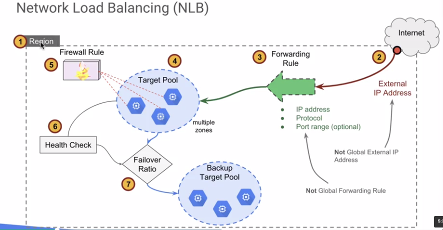

# [Interconnect Networking](https://cloud.google.com/interconnect/docs)
- overview
    - 3 methods
        - directly connect your data center network to googles
        - connect trhough an intermediary (network service provider that also offers interconnect services)
        - use technology like virtual private networking (VPN)
### GCP Networking Overview

- interconnection options
    - VPN (and cloud router)
    - cloud interconnect
    - direct peering

# [Cloud VPN](https://cloud.google.com/vpn/docs/)
### Cloud VPN (Virual Private Networks)
- Overview
    - securely connects your on-premises network to your GCP VPC network
    - traffic traveling between the 2 networks is protected as it travels over the internet
        - encrypted by one VPN gateway
        - decrypted by the other VPN gateway
    - SLA of 99.9% service availability
    - supports site-to-site VPN
    - Supports
        - static routes
        - dynamic routes (cloud router)
    - supports (IKEv1 and IKEv2) using a shared secret
    - uses ESP in tunnel mode w/ authentication
- VPN with static routes
    - with static routing, updating the tunnel requires
        - addition of static routes to GCP
        - restarting the VPN tunnel to include new subnet 
        - 
        
# Interconnecting Network Concepts
### Cloud Router
- Overview
- basically router that runs in cloud
    - provides BGP routing
        - dynamically discovers and advertises routes
    - supports graceful restart
    - supports ECMP
    - primary/backup tunnels for failover
        - MED
        - AS Path length
        - AS prepend
### Cloud Interconnect
- overview
    - provides direct physical connections and RFC1918 communication between on-premises network and googles network
    - transfer large amounts of data between networks
        - more cost-effective than purchasing additional bandwidth over public internet or using VPN tunnels
    - enterprise-grade connection to GCP
    - provides access to private (e.g., RFC1918) network addresses
    - enables easy hybrid cloud deployment
    - does not require use of and management of hardware VPN devices
    - compare:
        - cloud interconnect
            - connect through a service providers network
            - provides dedicated bandwidth (50mbps - 10Gbps)
        - Direct Peering
            - Connect to Google Cloud through Googles POPs
            - provides N X 10G transport circuits for private cloud traffic 
- dedicated interconnect considerations
    - must have a common point of presence with Google
    - router must
        - be a single mode fiber, 10GBASE-LR, 1310nm
        - must support
            - LACP for bonding multiple links from 10GB to 80GB and more
            - link local addressing
            - 802.1q VLANs
            - BGP-4 with multihop
            - support IPv4 link local addressing
            - EBGP-4
            
### External Peering
- Direct peering
    - BGP direct connect between your network and google's network at Edge network locations
    - autonomous system numbers (AS) are exchanged via IXPs and some private facilities
    - technical, commercial and legal requirements
    - 
- Carrier Peering
    - 
    - can obtain enterprise-grade network services that connect your infrastructure to Google by using a service provider
    - you can get connections with higher availability and lower latency, using one or more links
- Autonomous System (AS)
    - AS represents a collection of Internet Protocol (IP) routing prefixes under
    the control of an administrative entity representing one or more network operators
    - ASN refers to AS number which is allocated by internet assigned numbers authority (IANA)
    - a business entity with an assigned ASN generally implies that that entity owns one or more blocks of IP addresses
    - Googles ASN is 15169
- peering key concepts:
    - border gateway protocol (BGP)
        - BGP is used to route traffic among internet service providers or any entitites who are assigned their own ASNs
    - private network interconnect (PNI)
        - means "private peering"
    - peeringDB
        - freely available web-based database of networks that are intersted in peering
        - a resource for identifying candidates for peering
- details about direct peering
    - via edge point of presence (PoP)
    - uses the existing peering infrastructure Google uses for internet service providers (ISP)
    - Not a private MPLS line into Google data centers wher GCP services are located
    - for all google bound traffic , not limited to GCP
    - for public internet traffic via BGP with dedicated bandwidth but not necessarily private data exchange
    - discounted egress charges only apply to traffic flowing trhough the direct peering cross-connect which requires
    a pre-defined BGP advertisement of its repective IP range
        - the IP range for the announcement must be of /24 at the minimum
    - direct peering set up with Google NetOps Content Distribution (NCD) team
    (outside of GCP team)        
- Share GCP VPC networks across projects in your cloud organiztion using shared VPC
    - shared VPC allows:
        - creation of vpc network of rfc1918 ip spaces that associated projects can use
        - project admins to create vms in the shared vpc space
        - network and security admins to create vpns and firewall rules usable by the projects in the vpc network
        - policies to be applied and enforced easily acoross a cloud org
- shared vpc overview
    - make a vpc network shareable across several projects in your cloud org
    - host the vpc network in a shared vpc host project        
- connect two vpc networks regardless of shared projects/orgs using vpc network peering
    - vpc network peering allows yout to:
        - build saas ecosystems in GCP
            - make services available privately across different vpc networks in and across orgs
            - have workloads communicate in private rfc1918 space
        - vpc netwok peering is useful for orgs:
            - w several netwok admin domains
            - that want to peer w other orgs   
- vpc network peering advantages
    - vpc network peering provides the following advantages of using external ip addresses or VPNs to connect networks
        - network latency
        - network security
        - network cost
- private google access
    - enables virtual machine instances on a subnetwork to reach google apis and services using and internal IP address instead of an external ip address
    - allows VMs w/out internet access to reach google services 

### [Cloud DNS](https://cloud.google.com/dns/)
- overview
    - googles dns service
        - lookup that translates symbolic names to ip addresses
        - high performance dns lookup for you users
        - cost-effective for massive updates
    - manages dns records through api or web ui
    - request routed to the neares location, reducing latency
    - use cases
        - dns resolver for your companys users w/o managing your own servers
        - dns propagation of company dns records                
- cloud dns managed zones
    - abstraction that manages all dns records for a single domain name
    - one project may have multiple managed zones
    - must enable cloud DNS api in gcp console first
        - `gcloud dns managed-zones ...`
    - managed zones
        - permission controls at project level
        - monitor propagation of changes to dns name servers

# Managed Instance Groups
- overview
    - deploys identical instances based on instance template
    - instance group can be resized
    - manager ensures all instances are in RUNNING state
    - typically used w/ autoscaler
    - can be single zone or regional
- instance template
    - instance teplate dialog looks and works exactly like creating an instance except where it records the choices so it can repeat them
health checks determine whether instances are available to do work
    - health checker polls instances at specified intervals
    - instances that do not repond successfully to a specified number of consecutive probes are marked unhealthy
    - health checker will continue to poll instances
    - if an unhealthy instance later responds successfully to a specified number of consecutive probes it will be marked healthy
    - supported protocols
        - HTTP, HTTPS, TCP, SSL(TLS)
    - to ensure redundancy, GCP creates redundant copies of each health checker            
- managed instance groups offer autoscaling capabilities
    - autoscaling allows you to automatically add/remove instances from a managed instance group based on:
        - increases in load
        - decreases in load
    - define autoscaling policy and the autoscaler performs automatic scaling based on the measured load        
- connection draining
    - connection draining delays the termination of an instance until existing connections are closed
        - new connections to the instance are prevented
        - instance preserves existing sessions until they end or a designate timeout is reached (1 - 3600 seconds)
        - minimizes interruption for users
    - connection draining is triggered when an instance is removed from an instance group
        - manual removal, resizing, autoscaling, etc.        
 additional features
    - instance group updater (beta)
        - zero downtime and staggered releases
        - use instance group updater to apply a rolling update
        - apply canary updates with rollback
    - autohealing beta
        - automated server monitoring and restarts
        - if http health check sees a service has failed onn and instance, re-create instance where service failed        
        
### HTTP(S) load balancing        
- overview
    - http(s) load balancing
        - provides global load balancing for HTTP(s) requests destined for you instances
        - supports both IPv4 and IPv6 addresses for client traffic
        - uses instance groups to organize instances
    - http requestscan be load balanced based on ports:
        - 80
        - 8080
    - https requests can be load balanced on port:
        - 443
        
      
- backend services and backends
    - backend services are comprised of...
        - health check
        - session affinity settings
        - one or more backends
    - backend consists of
        - an instance group (managed or unmanaged)
        - balancing mode (cpu utilization or rat in request/second)
        - capacity scaler (ceiling % of cpu/rate targets)
    - backend service may have up to 500 endpoints per zone  

     
- url maps
    - load balancer can direct traffic to different instances based on the incoming url
    - url map designates which requests to send where
    - url maps are called host and path rules in console   
- traffic allocation for backend services
    - instances included in backend services may reside across:
        - zone
        - region
        - multiple regions
    - traffic is allovated by location and capacity
        - if instances nearest origin of request have capacity, requst is forwarded to that set of instances
        - if there are no healthy instances with capacity in a region, request is sent to next closest region w capacity
        - request to a given region are distributed evenly across backend services in that region        
- HTTPS Load Balancing
    - HTTPS uses SSL to establish encryption for a secure link
    - in http(s) load balancing the target proxy terminates the client-originated ssl session, therefore, https requires additional config of the ssl cert
        - provides a single place to maintain and update client certs
    - you can then load balance between the target proxy and the vms using either TCP or a separate internally-originated ssl session        
- SSL certs
    - to use https or ssl load balancing, you must create at least one ssl certificate to be used by the target proxy for the load balancer
    - each target proxy can be configured with up to 10 SSL certs
    - for each SSL cert, you create an ssl cert resource        
- https additional info
    - https target proxy accepts only TLS 1.0 and up when terminating client SSL requests
        - speaks only TLS 1.0 and up when backend protocol is https
    - load balancer blocks illegal requests
        - see documentation for details       
### Cross-region and Content-based load balancing
- cross region load balancing
    - http(s) only
    - corss-region using a single global ip address
    - requests routed to the closest region
    - automatically reroutes to next closest once capacity is reached
    - eliminates need for DNS-based load balancing
    
    
- content based load balancing
    - http(s) only
    - create multiple backend services to handle content types
    - add path ruls to backed services
        - /video for video services
        - /static for static content
    - config different instance types for different content types        

### SSL proxy / TCP proxy load balancing
- SSL proxy
    - another kind of load balancing
        - intended for non-HTTP(s) traffic using ssl
        - supports both ipv4 and ipv6 addresses for client traffic
    - benefits
        - performs global load balancing of SSL traffic, routing clients to the closest instance with capacity similar to what https load balancing does for http(s) traffic
        - client ipv6 requests are terminated at the global load balancing layer, then proxies over ipv4 to your backends
- tcp proxy load balancing
    - allows you to use a single ip address for all users around the world
    - automatically routes traffic to the instances that are closest to the user
    - intended for non http traffic
    - supports ipv4 and ipv6 addresses for client traffic
        - client ipv6 requests are terminated at the global load balancing layer, then proxied over ipv4 to your backends        
        
### Network Load Balancing
- overview
    - allows you to balance load of systems based on incoming ip protocol data
        - uses forwarding rules that point to target pools
        - target pools
            - list the instances available for load balancing
            - define which type of health check should be performed on the instances
        - network load balancing is a regional non-proxied load balancer
        - can be used to load balance the following types of traffic:
            - udp, tcp, ssl

- forwarding rules
    - consist of:
        - name
        - region
        - ip address (regional, not global)
        - ip protocol (tcp, udp; ah, esp, icmp, sctp)
        - ports
        - target-pool or target-instance
    - can be managed by
        - console
        - shell (gcloud utility)
        - comput engine rest api
- target pool resource
    - defines group of instances that should receive incomin traffic from forwarding rules
        - can only be used w forwarding rules that handle
            - tcp traffic
            - udp traffic
        - must create target pool before you can use w a forwarding rule
        - each project can have up to 50 target pools
        - target pool can have only 1 health check
            - network load balancing only supports http healthchecks
        - instances can be in different zones but must be in same regionl add to pool at creation or use instance group
 - `sessionAffinity` influences load distribution
    - hash method selects a backend based on subset of
        - source/destination ip
        - source/destination port
        - layer 4 protocol (tcp, udp)
    - possible hashes:
        - NONE
        - CLIENT_IP_PROT
        - CLIENT_IP
    - caution: if large portion of clients are behind a proxy server you should not use CLIENT_IP_PROTO or CLIENT_IP.
    Using them would end up sending all the traffic from those clients to the same instance     
    
### internal load balancing
- overview
    - allows:
        - load balance tcp/udp traffic using a private frontend ip.
        - load balance acrosse instances in a region
        - configure health checking for backends
        - get benefits of a fully managed load balancing service that scales as you need to handle client traffic
        

### Load Balancing Best Practices
- regional MIG (managed instance group) best practices
    - spreads and balances across 3 zones in a region
        - zones chosen at random
        - if zone becomes unhealthy, healthy zones take over
        - rebalances when zone returns
    - overprovisioning
        - provision at 100% for 2/3rd service during an outage
        - provision at 150% for full service during an outage
    - testing
        - tag VMs with "failure_zone"
        - run script w/ `sudo shutdown` to simulate outage
- keep in mind when created instance groups for load balancing
    - do not put vm in more than one instance group
    - do not delete instance group if its being used by a backend
    - avoid adding the same instance group to different backends
    - all instances in a managed or unmanaged instance group must be in the same vpc network
    - if using a MIG w autoscaling, dont use `maxRate` balancing mode in the backend service
    - dont make an autoscaled MIG target of two different load balancers
    - max size of MIG should be <= size of subnet    
- securing load balanced servers
    - to access load-balancced servers, firewall rule must be created for the appropriate networks
        - allows http(s) traffic to compute engine instances
    - best practice = create firewall rules allowing traffic only from GCP load balancer networks
        - 130.211.0.0/22
    - instances can be further secured by having no external ip addresses
        - load balancing uses internal up addresses
        - leave a bastion host by which you can manage these instances    
        
# Autoscaling
- overview
    - available as part of the compute engine API
    - used to automatically scale number of instances in managed instance group based on workload
        - helps reduce costs by terminating instances when not required
    - create one autoscaler per managed instance group
    - autoscalers can be used with zone-based managed instance groups or regional managed instance groups
    - autoscaler is fast typically ~1 min moving window
- how it works
    - controls managed instance group
    - adds, removes, instances using policies
    - policy includes number of replicas
        - max number
        - min number
        
### policies
- policies determine behavior
    - policy options
        - ave cpu util
            - if ave usage of total vcpu cores in instance group exceeds target, autoscaler adds more instances
        - http load balancing serving capacity (defined in the backend service)
            - max cpu util
            - max requests per sec per instance
        - stackdriver standard and custom metrics
- multiple policies
    - autoscaler allows multiple policies (up to 5)
    - autoscaler handles multiple policies by calculating recommended number of vms for each policy and   
    picking policy that leaves the largest number of virtual machines in the group
        - ensures enough virtual machines to handle app workloads and allows you to scale apps that have multiple possible bottlenecks     
        
### configuration 
1) create instance teplate (including startup, shutdown scripts) to automate tasks that must
take place while instance is unattended
    - software install
    - software startup and shudown
    - log archiving
2) create managed instance group
3) create autoscaler
4) optionally, define multiple policies for autoscalers       

# Infrastructure Automation Concepts
- reasons for automating infrastructure
    - repeatable re-deployable infrastructure
    - documented maintainable infrastructure
    - scalable solutions
    - huge architectures
    - complex systems

### images

        
- managing custom images
    - share custom images
        - share between projects using iam roles: `--image-project` tag
        - export to cloud storage bucket as tar file: `gcimagebundle`
    - image family
        - points at latest version of an image
        - reduces script/automation updates as versions change
    - deprecated -> obsolete -> deleted
        - deprecated - warning that image is not supported and may end
        - obsolete - existing users can continue to use it, but no new users
        - you can only delete custom images in projects you own        
        
### metadata      

- overview
    - project metadata - visible to all VMs in project
    - vm metadata - private to the VM
        - instance hostname
        - external ip address
        - ssh keys
        - project id
        - service account info and token
    - key:value pairs
        - directories containing key:value pairs
        - can return: specific value for a key, all keys in a directory, or recursive list of keys  
- query metadata
    - console, cloudshell or api
    - from VM, use wget or curl:
        - http://metadata.google.internal/computeMetadata/v1/
        - http://metadata/computeMetadata/v1/
        - http://<ip-address>/computeMetadata/v1/
    - using `gcloud`
        - project: `gcloud compute project-info describe`
        - instance: `gcloud compute instances describe <INSTANCE>`        
### scripts
- startup and shutdown scripts
    - linux
        - runs during VM boot, last step in boot process
        - any language valid on the VM, but bash is most common
    - windows
        - runs before boot or after boot
        - cmd or bat, but powershell is most common
    - shutdown scripts
        - best effort run triggered by terminate or restart
    - both startup and shutdown scripts are commonly specified when the VM is created but 
    can also be added after
- startup scripts
    - can be rerun after boot
    - common use cases include:
        - software installation
        - operating system updates
        - turn on services     
- shutdown scripts
    - best effort run on terminate or restart
    - ~ 90 secs on most machine types
    - ~ 30 secs on preemptible VMS
    - `gcloud compute instances create <instance> --metadata shutdown-script-url=<url>`

###Google Cloud API 
- cloud client libraries
    - go, java, python, node.js, php, ruby, c#
- installation
    - download: https://cloud.google.com/sdk/downloads
    - extract
    - setup paths and reporting: ./google-cloud-sdk.install.sh
    - init the sdk: `gcloud init`
- authorization
    - `gcloud auth activate-service-account --key-file [KEY_FILE]`  
- VM as automation engine
    - vm is authorized w a service account to use the google cloud API
    - software on the VM uses the API to create infrastructure on your behalf
             
2618199_student-hadoop-storage              
        
UNIQUE_ID=b6d173dafb4573e   
BUCKET_NAME=2618199_student-hadoop-storage     

# Deployment Manager
- overview
    - infrastructure automation tool 
        - creates GCP resources
        - not limited to 1 vm like and instance template
    - create the deployment template in a cloud api-enables environment such as cloud shell
        - view results and manage deployment in console        

        
        
### configuration        
- overview
    - creating a config
        - `*.yaml` file defines the basic config
        - include `import` at top of yaml file to expand to full-featured templates written in python or jinja2
        - program config is bidirectional and interactive: receives data like `machine-type` and returns data like `ip-address`
    - use "preview" to validate config before using it
    - ex
         - `gcloud deployment-manager deployments update accel --config *.yaml --preview`
- templates
    - can be nested
        - isolate specific functions into meaningful files
        - create reusable assets
        - ex: a separate template for firewall rules
    - have properties
    - can use env variables
    - supports the startup script and metadata capabilities
    - deployments can be updated - uses GCP API
        - add resources: default policy is `acquire` or `create` as needed
        - remove resources: default policy is to delete the resource        

### Cloud launcher
- overview
    - pre-packaged solutions by 3rd party vendors
    - a "solution marketplace"
    - separate fees
        - license fees for software
        - image usage fees
    - image usage fee vs. separate license (up to vendor)
    - google updates images, but not running instances
    - cloud tech partners
    
# Managed Services    

- data processing managed services
    - dataproc
        - spark, hadoop, hive, and pig
        - fully managed service
        - rapid scaling of cluster
        - open source ecosystem
        - fast easy to use, low cost
    - dataflow
        - data processing service
        - fully-managed service
        - processing patterns include
            - batch processing
            - strean processing
            - etl
    - bigquery
        - data analytics service
        - fully-managed service
        - interactive analysis
        - multi-petabyte datasets
        - unlimited storage

### Dataproc
- overview
    - low cost
        - fixed price
        - per-min bulling
        - custom vms
        - preemptible cms
    - fast
        - cluster provisioning
        - execution
        - server removal
    - maintanable
        - image versioning management for apache tools
    - scale
        - manually scale cluster as needed
    - support
        - spark
        - pyspark
        - spark sql
        - mapreduce
        - hive
        - pig
    - service integrations
        - cloud storage
        - big query
        - bigtable
        - stackdriver
- management opts
    - web ui
    - ssh
    - rest API
    - cloud sdk
- features
    - cluster start time
        - elapsed time from cluster creation until it is ready < 90 secs
    - billing is per-sec used
    - preemptible VMs
        - clusters can utilize preemptible vms for cost reduction
        - they function as processing nodes and do not store data
    - job output is easy to locate w/out log files review
    - job cancellation does not require ssh to the cluster
- cluster actions
    - startup
        - init actions in github or cloud storage
        - customize service account for increased IAM control
    - submit monitor and control jobs
        - cloud console
        - gcloud tool
        - cloud dataproc api
    - stackdriver monitoring
        - stackdriver agents enabled by default can be disabled    

### Dataflow
- overview
    - no-ops
        - fully-managed
        - auto on-demand resource allocation
        - auto-sizeing of workers (horizontal autoscaling)
        - freedom from operational tasks
    - features
        - liquid sharding
        - autoscaling mid-job
    - unified programming model
        - apache beam sdk
        - separates data processing requirements from data source
        - apply solutions to both batch and stream data
    - service integrations
        - cloud storage
        - cloud pub/sub
        - bigquery
        - bigtable
        - cloud datastore
- dataflow programming concepts
    - pipelines
        - series of computations that accepts data and transforms it
        - output can be to output sink or internal sink
        - input source and output sink can be the same, allowing data format conversion
    - PCollections
        - specialized container of nearly unlimited size that represents a set of data in the pipeline
    - transforms
        - a data processing op
    - I/O sources and sinks
        - different data storage formats (Cloud Storage, BigQuery, tables and more)
        - custom data source/sink   
        
    
              

### BigQuery
- overview
    - analytics data warehouse
        - fully-managed
        - pb scale
        - sql interface
        - very fast
        - free usage teir
- management options
    - WebUI
    - SSH
    - REST API
    - cloud SDK
    
### Other Services
###### Cloud datalab
- overview
    - interactive tool for data exploration
        - large-scale data
        - data analysis
        - visualization
    - accepts input from
        - BigQuery
        - Compute Engine
        - Cloud Storage
    - support 
        - python
        - sql
        - JS
- jupyter notebook combines:
    - code
    - documentation
    - results
    - visualizations
###### Data Studio
- decision support report generator
- useful for making data-backend architectural recommendations

        
            