# OverviewfLyMd-mAkEr
- application infrastructure services
    - services commonly required by app and systems
    - services that van be provided by an infrastructure better than by the app itself
    - communication between distributed parts of an app
    - api exposure and management
    - functions that run w/out explicit server
    
# App Infrastructure Services Concepts
### Cloud Pub/Sub 
- Overview
    - fully managed real-time messaging service that allows you to send and reveive messages between 
    independant apps
    - decouples the sender and receiver
        - asynchronous comms
    - many benefits over direct communication
- benefits
    - scaled globally
    - low latency
        - dynamic rate limiting
    - availability
        - durability - replicated storage of messages
        - reliability
        - end-to-end reliability via app ACKs
    - security 
        - encryption in motion and at rest
    - maintenance free
    
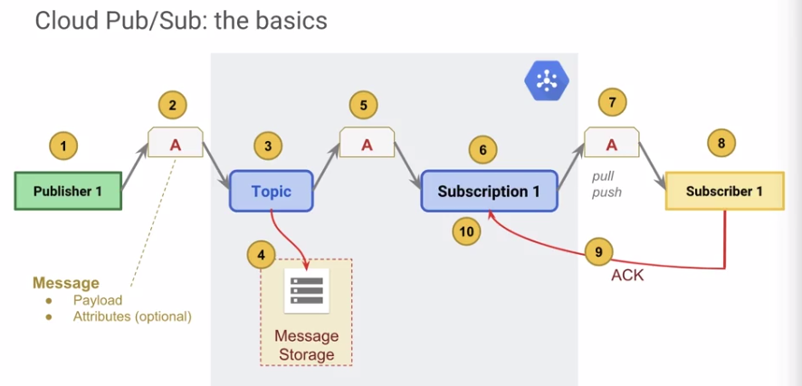
1) publishes wishes to publish message
2) message consists of payload and aptional attribs that describe payload
3) published to specific topic (feed of messages)
4) topic stores message, ensuring availability/reliability
5) message transmitted to one or more subscriptsion (entity that represents interest in reveiving messages)
6) subscription detwermines which subscribers are registered to receive the message and queus up the messages to be sent
7) subscribers can receive message through pull/push
8) message arrives at subscriber where it is consumed
9) subscriber sends ack to the subscription
10) subscription registers each delivery, when all deliveries are complete, it removes the message from queue

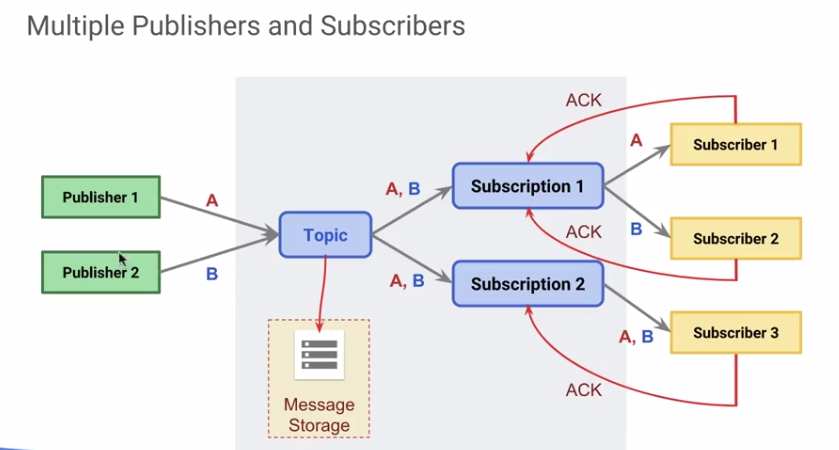

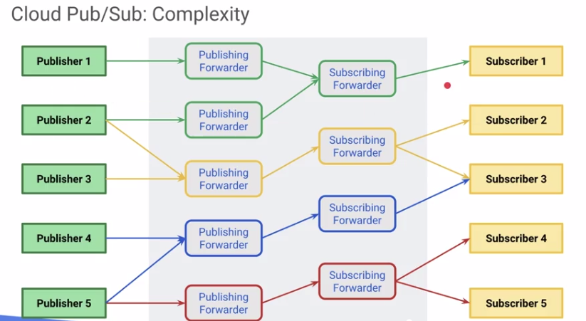

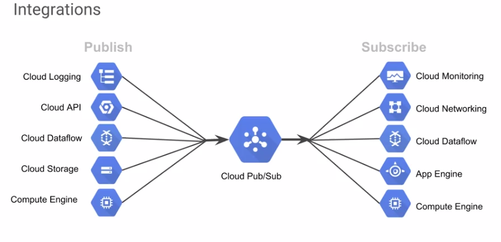

- use cases
    - balancing workloads in network clusters
    - implementing asynchronous workflows
    - distributing event notifications
    - refreshing distributed caches
    - logging to multiple systems
    - data streaming from various processes or devices
    - reliability improvement

### API Management
######cloud endpoints
- helps create, deploy, protect, monitor, analyze and serve yout aps
- exposes an api for front-end client for mobile or web app to make use of cloud-based app services
- frees developers from writing wrapper to access app engine resources from a mobile or web client
- use any language and framework to write api, add open api spec or gRPC api config, and endpoints will monitor and protect api

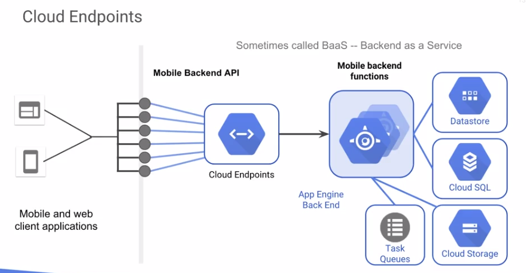

- general
    - autoscales
    
###### Apigee
- overview
    - api interfaces wraps your apis
        - analytics
        - data transformation and validation
    - provides API management
        - version control
        - granular access control - credentials token/keys
        - scales
        - global distributiton, multiple clouds, SW, SOA, SOAP
        - cache support for performance improvement
        - limits (rate limits) to prevent DDOS or runaway bad code
        
### Cloud Functions
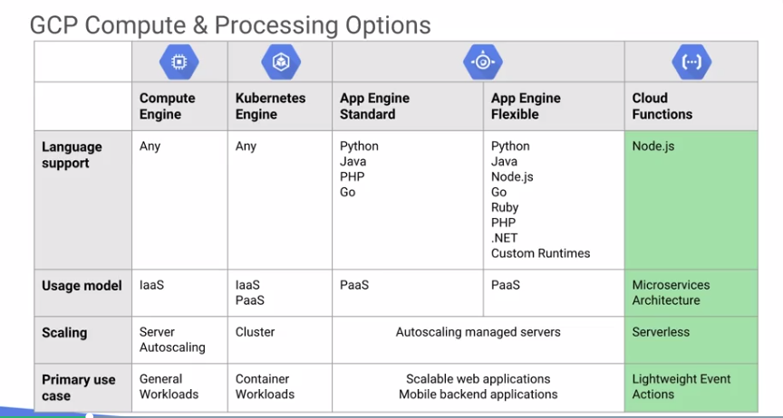

- lightweight compute solution for developers to create single-purpose, stand-alone functions that respond to cloud events w/out
 need to manage a server or runtime env
- event-based microservices
- fully manged, serverless, secure
- triggers
    - Cloud Pub/Sub, Http, cloud storage
- code
    - deploy functions from a cloud storage bucket, github or bitbucket repo
    - written in JS and runs in Node.js
- stackdriver integration

### Cloud Source Repos
- overview
    - Private git remote on GCP
        - iam roles: owner, editor, viewer
        - stackdriver integration
        - console source code browser
    - create repo
        - `gcloud init`
        - `gcloud alpha source repos create REPO_NAME`
    - can be a mirror of a hosted github or bitbucket repo
    - can connect cloud source repos to a hosted repo on github or bitbucket when you push a change to the connected repo, it is auto synced to the cloud platform repo

### Specialty apis
- cloud machine learning
    - add prediction and ai to your app
        - cloud machine learning engine
        - cloud job discovery
        - cloud natural language api
        - cloud speech api
        - cloud translation api
        - cloud vision api
    - can add these specialty functions to your apps w amazingly little coding

# App Engine Concepts
### App Engine
- overview
    - platform as a service (PaaS)
        - infinite autoscaling
    - standard env
        - fully-managed
        - scale to zero
        - specific version fo supported languages
    - flexible env
        - docker container support
        - vms exposed
        - any language in your container

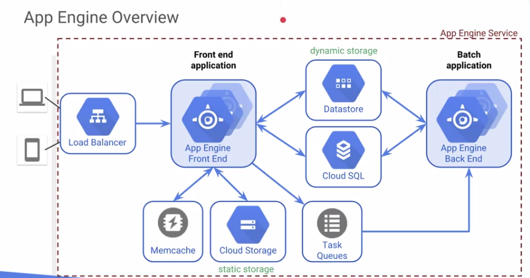

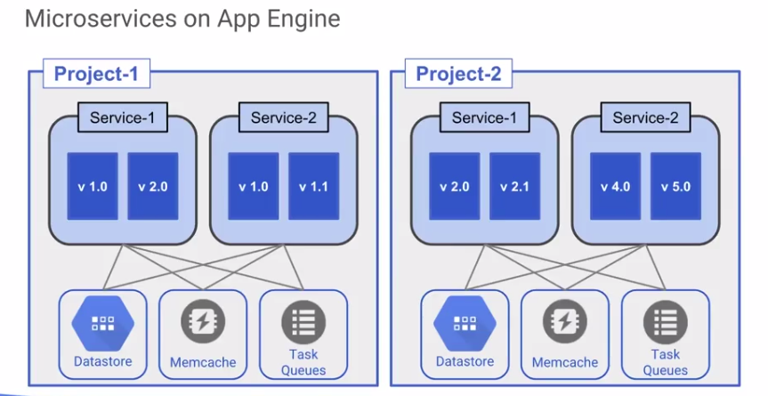

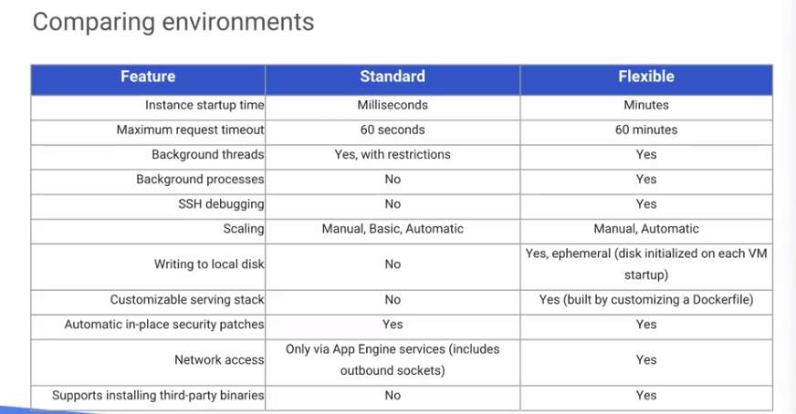

# Container Concepts

### Containers

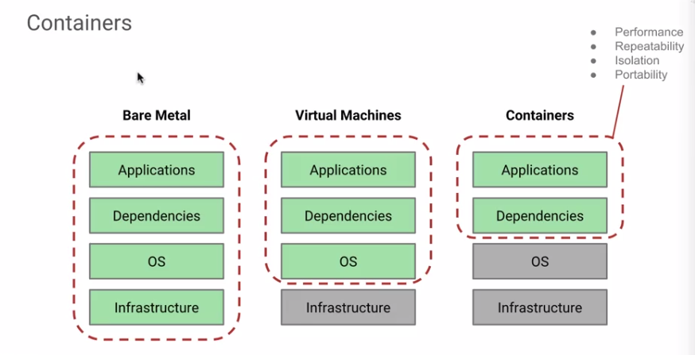

- benefits of container-based solutions
    - manage app, not machines
    - maintain vendor independence
    - write once, run anywhere
        - develop app on premise
        - upload to cloud for production and scale
    - workload relocatability
        - migrate to new platform
    - decouple apps from dependencies
        - ex: namespaces, services, DNS, secrets, specific APIs
        
### Kubernetes Engine
- kubernetes (aka "k8s)
    - open source project
    - framework for container management and automation
    - based on googles systems
    - developing rapidly - complex
        - only covering the basics in this class
        - only covering kubernetes engine in this class
    - more info [kubernetes.io](https://kubernetes.io/)
- kubernetes engine
    - fully managed service
        - kubernetes sofware maintaines
        - SLA
    - docker format containers
    - autoscaling (CPU or memory)
    - stackdriver logging and monitoring
    - cloud vpn integration
        - hybrid cloud and on premise solutions
    - cloud IAM integration
- container cluster
    - each node runs:
        - docker runtime
        - kubelet agent
            - manages scheduled docker containers
        - network proxy
        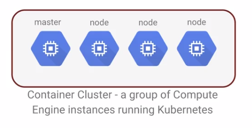
- kubernetes master
    - endpoint -- doorway to the cluster
    - kubernetes API server
        - services REST requests
        - schedules pod creation/deletion on nodes
        - syncs pod info w service info
    - cloud services integration    
    - google takes over master management for you    
- container organization
    - pods
        - kubernetes engines abstraction to represent and app
        - holds one or more containers
        - containers in the pod share
            - single ip address
            - single namespace
        - recommended to usually only run one container per pod
        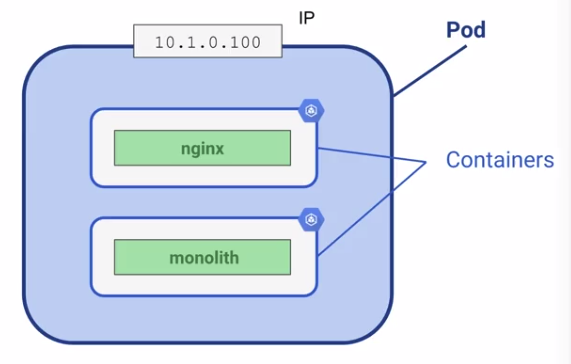
        - gives access to centralized storage
- kubernetes engine labels
    - arbitrary key:value pairs
        - applied to pods and other objects
    - used by kubernetes engine for orchestration
    - label selector
        - a query on the lables
        - labels batchine selector have operations applied

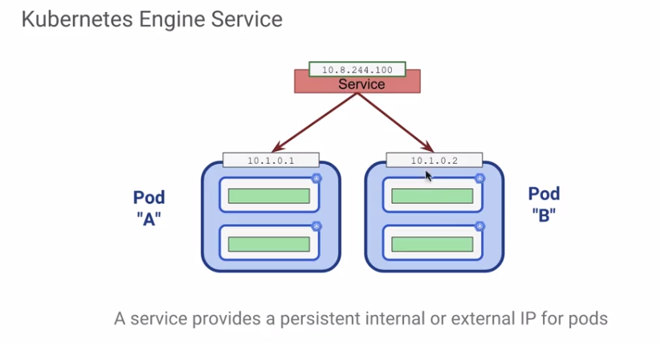

- deployment
    - gives rules for how to autoscale individual nodes
    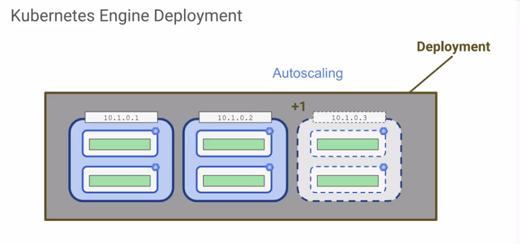
    
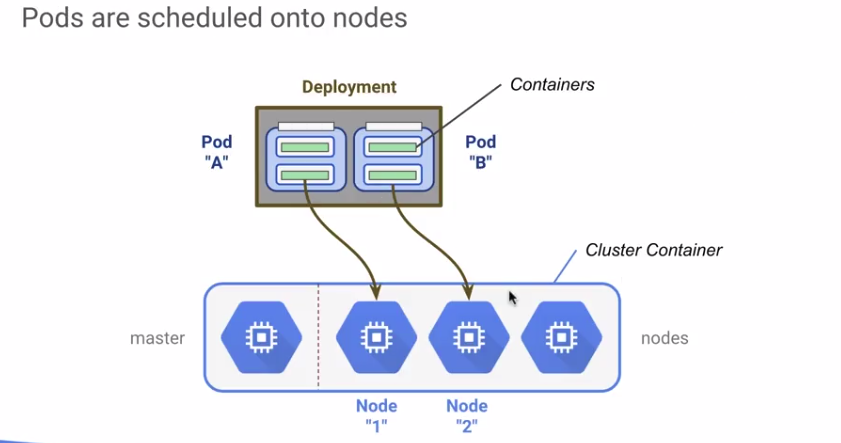

- deployments provide built in resiliency
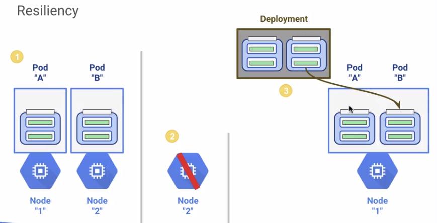

- rolling updates
- iam support
    - roles
        - `container.admin`
            - full management of container clusters and their kubernetes API objects
        - `container.clusterAdmin`
            - management of cluster containers
        - `container.developer`
            - full access to kubernetes API objects inside container clusters   
        - `container.viewer`
            - read-only access to kubernetes engine resources
 - Multi-zone Container Clusters
    - spread across multiplke zones for resiliency
    - container resources replicated in additional zones and work is scheduled across them
- Node Pools
    - instance groups in the kubernetes cluster
        - all vms in a pool are the same
        - pools can contain diff vms from one another
        - pools can be in diff zones
    - kubernetes engine is node pool-aware
        - lables on VMs in the pool are avaiable to kubernetes engine
    - node pools and multi-zone container clusters
        - kubernetes engine will replicate all the pools along w all the clusters
        - careful! could use up quotas in region
- More Kubernetes Engine Features
    - cluster federation
        - multi-region cluster containers
        - alias IP
        - allocate pod ip addresses from a CIDR block
        - clusters can interact w other services
    - network load balancing
    - cluster autoscaler
- federated clusters
    - single logical compute federation
    - federate multiple clusters across different regions, cloud providers, or on premise installs
    - benefits of federations
        - highly available
        - geographically distributed services
        - hybrid cloud
        - simplifies deployment
    - this simplifies deployment of scenarios
    
### Container Registry
- overview
    - docker container images
    - public and private container storage
    - fast, scalable retrieval and deployment
    - billed for storage and egress, not per image
    - works w/ open and 3rd party continous dilivery systems
    - iam roles
    - acls for access control

### kubernetes engine, app engine, or containers on compute engine?
- genereal differentiators
    - containers on compute engine
        - use containers on compute engine when you absolutely want control over the VM resources but also want the benefit of Docker image development
    - app engine standard
        - very fast scale-up, scales down to zero, no docker containers
    - app engine flexible
        - "code first", developer focused, simpler to use than kubernetes engine
    - kubernetes engine
        - multi-cloud on on prem deep controls over container orchestration

