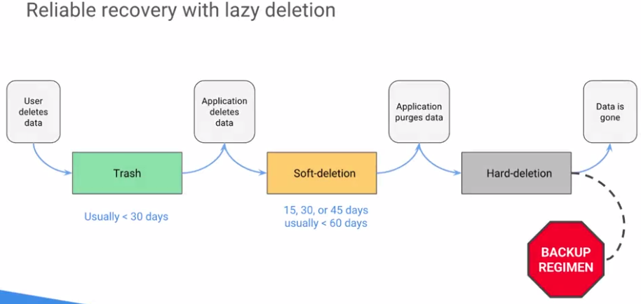
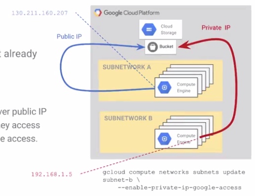

# Defining the Service
### overview
- no unversal solutions, only contextual
    - even the best design patterns won't work in every situation
    - have to consider limnits and possible issues in the context of use
- recency bias
    - peaple tent to grab a great new idea or design pattern and use it for everything - overuse it - whcih can create problesm later
    - consider which designs and tools work bes in which context
    - every tool has an appropriate or best application
###### design process
1) begin simply. iterate
  - compose simple services. build up to complexity. iterate

2) plan for failure
  - avoid bottlenecks
  - avoid single points of failure
  
3) measure stuff
  - consider the hardware and services
    - what are the limits?
    -  how might they fail? 

### State and Solution
- state
    - any action in system that depends on memory of a preceding action and the data that must be remembered is called state info
    - cornerstone of any cloud-based design
- where is truth in a system
    - a central control mechanism is a choke point on performance and a single point of failure
    - how can parts of a system work together w/put a central control?
- how should you deal w/ state?
    - base state is no state
        - make as much of your system as possible stateless
        - easier to apply more workers to a problem
        - easier to relocate taskes
        - more fault tolerant, less to recovery when something breaks
    - sources of state
        - objects in a database
        - shared documents in memory
        - key-value pairs for user
    - critical state
        - assuming you need state what is best way to implement it and manage it
- worst case for stat is a hotspot
    - state and design
        - in the works case, all requests for same user route to the same frontend
        - balancer is doing the opposite of balancing it is creating hotsots
        
    
- stateful servers puched to lower in the stack
    - stateless frontends
    - separate read and write paths
    - caching of the read path
    - push stateful servers lower in the stack
    
    
- divide state to reduce impact or an outage
    - divide and distribute state among stateful backend serverw
    - load balancer maps ID to backend
    - single machine = 100% unavailability
    - multiple machines = partial unavailability
    - redundant state = ability to recover state
    - could introduce latency, but overcomes many problems
    
    
- general solution for larege-scale cloud-based systems

### Measurement
- defining a service level
    - service level indicators (SLI)
    - service level objectives (SLO)
    - service level agreements (SLA)
- service levels help you
    - qualify and quantify the user experience
    - balance investment in reliability vs. features
    - set user expectations for availability and performance
- to define a level of service for a workload
    - identify the service level indicators (SLIs)
    - determine an appropriate SLO
    - optionally extablish a SLA
- SLIs
    - measurable attribute of the service that represents its availability and/or performance
    - something user actually is exposed to. Not some backend think like cpu utilization
- SLO
    - how the service should perform
    - based on the users experience which is measured using the SLIs
    - threshold value for SLI
- SLAs
    - binding contract to provide the customer compensation if the service doesnt meet specific expectations
    - more restrictive version of SLO

- Service Level Indicators (SLIs)
    - quantitative measure of an attribute of the service - one that the users care about - such as:
        - throughput
        - latency
        - availability
        - correctness
    - not all stats should be SLIs
    - an SLI should:
        - represent the users experience.
        - reliably represent the health of the system
    - identifying the SLIs
        - what functions or behavior do the users care about?
        - how do the users quantify a good or bad experience?
    - considerations
        - to properly determine the availability/ performance of a service, you might need to observe factors that surround the service
- Service Level Objectives (SLO)
    - threshold at which point you will change your behavior to improve the reliability of the service
    - examples
        - change velocity of updates
        - change your development process
        - devote engineering efforts to reliability
    - good SLO focuses on the users experience instead of the internal system
    - An SLO represents the users "pain tolarance", where pain is a measurement of an SLI
    - detrmining the slo
        - driven by business requirements, not necessarily current performance
        - minimize the number of SLOs for your service, although if you add features you might need to add SLOs
        - focus on SLIs reflected in the four golden monitoring signals:
            - latency
            - traffic
            - errors
            - saturation (resource usage) 
    - create actionably alerts
        - slos should represent the user experience, not necessarily the service load
        - will someone get up at 3am on sat to investigeate? if not, maybe its not SLO
- Service Level Agreement (SLA)
    - business contract between provider and the customer
    - stipulates that
        - a penalty will apply to the provider if the service does not maintain certain availability and/or performance threshols
        - if the SLA is broken, customer will reveive compensation from the provider
    - not all services have an SLA, but all services should have an SLO         
- user personas for indicators
    - define your users to serve them better
    - what do groups of users really care about? how can you identify, define, and measure that?

### Gathering Requirements
1) qualitative requirements
  - why
    - why is the system needed or desired
        - what problem does it solve
  - who
      - who are the stakeholders and who are the users?
          - what do they care about and not care about
      - who is developing this?
          - what is in scope? what is feasible and what is not feasible
  - what
      - what does the system need to do?
          - what are the priorities, required verses nice-to-have?
  - when
      - when do the users need and/or want the solution
          - are there any time/value tradeoffs, such as faster versus better?
          
2) quantitative
- resources
    - time
    - people
    - finance
- constraints
    - time
    - operational time constraints
    - cost of downtime
- data
    - cost of data lost
    - data volume
    - throughput
    - freshness
    - groups of data
- users
  - number of users
  - location of users

3) scaling requirements
- growth tends to be iterative and new solutions need to be found as scale issues arise
- limiting factors
    - what will limit your ability to grow your app
    - which resource constraints are important to pay attention to?
    - how can you design to push past these limits when necessary
    
4) size requirements
- which factors are important to the size of a solution
    - dimensions
    - replication
    - rate of change 

# Business logic layer design
### Design Overview
- business logic: 
    - "in computer software, business logic or domain logic is the part of the program that envodes the real-world business rules that determine how data can be created, stored, and changed"
    - code that implements business rules that determines what happens to data
    - operates on data
    - part of the design process where youll consider cloud processing options and determine what service the business logic code will use when it needs to run 

### Microservices Architecture
- microservices architecture
    - medthod of developing software apps as a suite of independently deployable, small, modulare services
    - each service runs a unique process and communicates trhough a well-defined, lightway mechanism
    - each service contributes to a business goal
- benefits of microservices design
    - benefits of small separate servies
        - atomic, single-purpose code is easier to develop and maintain
        - does one thing and does it very well
        - supports A/B testing
    - independently developed services aid in
        - fault isolation
        - debugging
        - redundancy and resiliency
    - BUT... harder to understand how the microservices interoperate
        - unit testing is easier, integration testing is harder
        

- use microservices where they make sense in the design
    - when there are many consumers of an atomic unit of functionality
    - when one consumer of tightly-coupled functionality, microservices add overhead w/out much benefit
    
- cloud functions
    - useful in microservices design
    - limitations
        - not a low latency service
        - because it is serverless, there are few resources that can be adjusted for price/performance tradeoffs
    - 
    
- microservices design on Google App Engine (GAE)
    - microservices can be implemented as GAE services
        - full code isolation
        - can be written in different languages
        - code executed through HTTP invocation/RESTful API
    - limitations:
        - there are shared services that must be isolated in the application design
        - one master app per project
        - multiple apps incur additional overhead
        
- GCP [12-factor](https://12factor.net/) support
    - 12-factor design
        - popular methodology for devs to follow when building modern web-based and cloud-based apps
    - GCP techs support 12-factor design
             
- 12-factor development tools and platforms in GCP
    - one codebase tracked in version control; many deployments
        - cloud shell for building and deploying
        - cloud Source Repos / github support
    - strictly separate build and run stages
        - build GAE app in Cloudshell, upload to GAE
    - keep development, staging and production as similar as possible
        - deployment manager templates
        
- 12-factor software design infrastructure services in GCP
    - explicitly declare and isolate dependencies
        - custom images
    - store congif in the inv
        - metadata server, GCS
    - maximize robustness with fast startup and graceful shutdown
        - instance templates, managed instance groups, and autoscaling
        
       

###### mapping compute needs to platform products
- general
    - business logic (app) uses cpu
    - where does it get compute resources?
- which platform can service speed, reliability and scale w/ the least amount of effort?
    - if you can use native GCP service, you may not need to design anything fancier
    - Google App Engine (GAE) is 
        - code-first so it is easier to use to create new applications
            - focus on programming, minimize it work
            - minimize ops overhead
        - autoscales
        - highly availabile and reliable
        - often sufficient solution on its own
        - containers can be run on GAE flex

- google bebernetes engine
    - platform independence
    - separate apps from OS
    - no OS dependencies
    - already using kubernetes and need to scale
    - apps can be containerized
    
- Google compute Engine (GCE)
    - need processing efficiency
    - migrating an app from a data center w/out rewriting it
    - dependencies on a specific OS
    - required to use an existing VM image
    - direct hardware access (GPUs, SSDs)
    - Driver-level access
    - hardware performance is critical
    
###### Compute System provisioning
- general
    - deciding how the system will acquire new compute resources and adapt to changing requiremenets
    - GAE = autoscaling platform
    - GKE autoscakles based on containers and pods w/in cluster
    - this section applies to GCE and VMs
- horizontal scaling issues and answers
    - more server lifecycles to manage (deployment complexity)
        - automation makes this easy
    - end-to-end latency increases slightly
        - requirements will indicate whether the latency matters
    - more overhead, but unlikely to matter
        - outweighted by the benefits of decoupling scaling, failures, upgrades, config and so forth

- horizontal scaling design
    - keep server simple: do one thing well
        - minimize complexity
        - construct simple and concise APIs
        - identify where tasks are separable
        - split into separate servers
    - prefer small, stateless servers
        - easy to scale; no state to shard/rebalance
        - failure is cheap; no state to migrate/recover
        - easy to load balance; no hot-spotting
        
- tradeoffs: balance latency, capacity, scalability, and cose
    - small stateless servers increase reliability and scalability
        - divide into parts
        - duplicate and coordinate
        - separate and isolate
    - large stateful servers reduce complexity and latency
        - unify
        - simplify and consolidate
        - coalesce and colocate
    - methods of achieving balance in you design
        - what are your SLOs? what does you users value?
        - what is the optimal size and number of parts
        - sometimes central control is necessary/optimal
        - plan on adjusting, and build adjustment processes
        
- design first, dimension later
    - trying to dimension the solution before the design is completed and before it is iterated and evolved can lead to confusion
        - same true of cost optimization.

# data layer design
### Classifying and Characterizing Data
- users care about data integrity
    - every service has separate data requirements
    - users do not distinguish between data loss, data corruption, and extended unavailability
    - as an engineer
        - presistence and Access are separate
        - access - a loss of data access is very important to users
        - Persistence - proactive detection and rapid recovery

- what data transaction properties are required
    - CAP Theorem
        - pick two
            - consistency
                - ACID
                    - atomicity
                    - consistency
                    - isolation
                    - durability
            - availability
                - BASE
                    - basically available
                    - soft state
                    - eventual consistency  
            - partition Tolerance

- What are the data consistency requirements?
    - GCS global stron consistency
        - read-after-write
        - read-after-metadata-update
        - read-after-delete
        - bucket listing
        - object listing
        - granting access to resources
    - GCS eventually consistent
        - revoking access (~1m)
        - enabling object versioning in a bucket wait ~30 sec before write/overwrite
    - a cached object may not show strong consistency
        - control the degree of consistency of objects in a cache
        - by setting metadata and cache lifetime

- what are you trying to optimize?
    - data stategy you choose for a service depends on which requirements you are trying to optimize
        - uptime
            - propotion of time that a service is unavailabile to users, Availability
        - latency
            - how responsive a service appears to be to its users
        - scale
            - the volume of users and mix of workloads the service can tolerate before latency suffers or the service begins to fail
        - velocity
            - how fast a service can innovate to provide superior value at reasonable cos 
        - privacy
            - data must be destroyed w/in reasonable time after a user deletes it

### Data Ingest and Data Migration
- GCS tools for data migration
    - console (drag and drop) interface
        - simulated folder icons for familiarity
    - gsutil
        - resumable upload and download
        - streaming transfer
            - chunked transfer encoding
    - JSON API
        - gzip
            - reduce network bandwidth at the expense of CPU
            - transcoding of gzip compressed files
        - partial resource request/reply
    - control access with Cloud IAM, Signed URLS, and ACLs
    
- Cloud storage transfer service
    - import online data to GCS
        - Amazon S3
        - HTTP/HTTPS location
        - transfer data between GCS buckets
    - backup data to GCS
        - move from multi-regional to nearline
    - synchronize
        - one time, recurring, import at time of day
        - delete objects not in source
        - delete source objects after tranfer
        - filter on file-name, creation date   
        
- Google Transfer Appliance
    - rackable device up to 1PB ship to google
    - use transfer appliance if you dataset meets the following conditions:
        - if it would take more than 1 week to upload your data
        - data >= 60 TB, regardless of conn speed
           

### Identification of Storage Needs and Mapping to Storage Systems

# Presentation layer design
### Network Configuration
- location of resources w/in cloud network is significant
    - time in ms, 1 million ns = 1 ms
        - send 2kB over 1 Gbps network | 2000ms | .002 ms
        - round trip w/in same datacenter | 500000ns | 0.5 ms
        - send packet CA -> Netherlands -> CA | 150,000,000 ns | 150 ms
        
    - no more than 6-7 round trips between Europe and us per second are possible, but ~ 1000 per second can be achieved w/in datacenter
    - the tech that allows you to control the network location of resources used by your service is load balancing

- load balancing 
    - provides control over location and scale
    -  get user traffic to app servers w/ capacity in the closest region -- giving you design control over network loc
    - scale services by distributing traffic over multiple servers and triggering autoscaling
    - google provides several load balancing services that offer diff loc controls and traffic distr methods. optimized for different use cases

- selecting load balancing services
    - global
        - http(s)
            - proxied
            - cross-region
            - content-based
            - ipv4 / ipv6
        - ssl Proxy
            - proxied
            - certificates
            - intelligent routing
            - ipv4 / ipv6
        - tcp proxy
            - proxied
            - intelligent routing
            - ipv4 / ipv6
    - regional
        - network
             - pass-through
             - any tcp or udp
             - session affinity on/off
             - health checks
        - internal
            - proxied of pass-through
            - any tcp / udp
            - internal ip
            - requests stay w/in VPC
            - software defined

### integration w/ other envs
- cloud external IP address
    - gcp offers global static external IP addresses
        - can use global IPs in DNS records
        - they are only availabile to global forwarding rules
        - global forwarding rule is used for global load balancing
        - cannot assign global IP address to regional or zonal resource
- cloud cdn (content deliver network)
    - uses googles globally distributed edge points of presence to cache HTTP(S) load balanced content close to you users
    - caching content at the edges of Googles network provides faster delivery of content to your users while reducing costs
        - lowers network latency
        - offloads origins
        - redices server requirements
        
                

- VPN Performance
    - verify that the capacity of the peer devices matches the VPN gateways
    - many settings, including MTU, which is normally dynamically set
    - can influence performance by changing encryption during setup
        - AES-GCM offers highest throughput
    - if you are measuring throughput over VPN, use multiple TCP streams
        - iperf -P

# Design for resiliency, scalability and DR
- a highly available or resilient web app is one that continues to function despite expected or unexpected failures of components in the system. If a single instance fails or an entire zone experiences a problem, a resilient app remains fault tolerant 
  - continuing to function and repairing itself automattically if necessary

- resiliency
    - quality of a design that accounts for and handles failure
    
### Failure due to loss    
- overview
    - failure due to loss of resources required by the service
    - single points of failure
    - correlated failures

- failure is not optional it is mandatory
    - anticipate failure, design for failure, and fail gracefully
    - hardware will fail
        - dont depend on it
    - software will fail
        - modularize, monitor, test, canary
    - people will fail
        - review procedures, escalate
    - communications will fail    
        - dont assume it happened. internet is designed to route around failure

- single points of failure (SPOFs)
    - hardware (multiple machines, racks, power sources, etc)
    - network path (load balance)
    - data (replicate/copies)

- design to avoid SPOFs
    - a spare spare, n+2
        - n + 2: plan to have one unit out for upgrade and survive another failing
        - make sure that each unit can handle the extra load
        - dont make any single unit too large
        - dont concentrate responsibility into a single process or server
        - try to make units interchangeable clones
    
- correlated failures
    - correlated failures occure when related items fail at the same time
        - single machine fails, all requests served by machine fails
        - top of rack fails, entire rack fails
        - a zone or region is lost, all resources in it fail
        - servers on the same software run into the same issue
        - a global config system upon which multiple systems depend is lost
    - the group of related items that could fail at one time is a failure domain    
    
- design to avoid correlated failures
    - decouple servers, use microservices
        - divide business logic into services based on failure domains
        - split responsibility into components and spread over multiple processes
        - separate and isolate the risks
        - design independent but collaborating services
        
### Failure Due to Overload        
- overload failure is when a resource crosses into non-linear behavior. It can crash, thrash disk, stop responding,
  or break adjacent resources that the service depends on
    
    

    
- design to prevent cascading failure
    - this is a case where prevention is the best strat
    - monitor "safety" zones
    - increase size for failover and not just operating capacity
    - ex: no single frontend should have more than 80% CPU utilization
        - note that cup utilization is an internal metric, not an SLI or SLO, because it is not directly visible to the users
        - this design requirement is supported by the existing availability and performance SLOs, which are observable by the users    

- Design to mitigate incast overload
    - tree architecture limits single-server fan-in
    - leaves generate data and forward to parent node.
    - nodes combine data from children and send merged response to parent node
    - cost is distributed and bottlenecks are reduced
      
    
- queries of death overload failure
    - problem: business logic error shows up aas overconsumption of resources and the service overloads
    - solution: monitor query performance iteratively. ensuer notification of these issues gets back to the devs
    
- Positive feedback cycle overload failure
    - problem: 
        - you try to make the system more reliable by adding retries and instead you create the potential for an overload
        - retries: adding retries where there were none before
        - changes to load balancing w/out considering the behavior during overload conditions
        - crash looping
        - herd behavior
    - solution: prevent overload by carefully considering overload conditions whenever you are trying to imporve reliability with feedback mechanisms, such as retris
     
- Detect Overload: Early warning systems (canaries)
    - an early warning system that tests key activites before the real activity occurs or before the action is scaled up
    - ex:
        - launching and testing a single server before enabling autoscaling on an instance group 
        
### Coping w/ Failure   
- overview 
    - preparedness
        - the time to prepare for an emergency is before it happens
        - no suprises
    - people dont plan to fail, they fail to plan
    
- forest fire or controlled burn?
    - planned rotating outages force system preparedness for unplanned outages, developing system resiliency    
    
- Prepare the team using simulation sessions
    - experienced member presents a failure scenario
    - team member(s)
        - investigate using systems monitoring and diagnostics
        - determine the cause
            - loss failure
            - overload failure
        - present startegies for fixing the issue
        
- incorporate failure into SLOs
    - the level of service over which the user is accessing you app limits the level of service they will be able to sense in your app
        - dont over engineer
    - there are diff kinds or reliability
        - users may not differentiate them
        - you still have to address them separately in you design
    - define the gap between user expectations and system reliability:
        - establish margin of sagety
        - incorporate scheduled downtime   
        
- meetings matter for resiliency
    - overload detection and prevention
        - plan and review production SLOs and SLIs
        - software development lifecycel plan (SDLC) to identify overload risks
        - analyzing and defining business processes, including policy for degraded service and service outages
        - develop procedures to test resilience of solution in overload conditions  
        
- stategies for dealing with failure
    - redesign
        - remove the faulty or at-risk component from the design
    - prevention
        - take steps to ensure a failure that is possible does not occur
    - detection and mitigation
        - detect a failure before or as it is happening and take steps to reduce or eliminate the effect of it
    - graceful degradation 
        - instad of failing completely, handle stress and return to full service once the issue passes
    - repair
        - fix the problem. hopefully it wont come back. at least not in the same way
    - recover
        - allow the problem to occur and get service back as quickly as possible.
        - measure indicators of recovery and work to improve them.                      
    
### Business Continuity and Disaster Recovery    
- Cloud DNS
    - Helps users find your service
        - a low latency, high availability way to make your apps and services availabile to your users
    - resilient design
        - if the primary service goes down, use DNS to redirect users to the backup service    
    
- users care about data integrity
    - data integrity is the quality of the data remaining accurate and accessible
        - if the data loses accuracy or accessibility, it is no longer reliabile to the system (and the users), and therefore has lost integricy
    - many kinds of failures, including human error, can lead to data loss
        - strategy is defense in depth    
    
    
- goal isn't backup or archive, it is restore.
    - whats the point of keeping old versions of data if not to restore them?
    - backups ofter are really archives
    - in general, dont care about backups care about restore
    - how long would it take to restore from backup and does it work
    - for confidence
        - periodic testing = low confidence, high chance of interruption
        - automate restore from backup and have it running continuously or periodically to gain confidence
    - incorporate recovery testing into you design  
    
- tiered backup for resiliency
    - tier 1
        - frequent backups, quickly restored, close to data store, may be the same tech as the data store
        - backsup are kept for hours to days, usually < 10 days
    - tier 2
        - qualities
            - backups twice a week, may take hours to restore
            - backup to random access distributed file
            - system local to the app
        - frequency
            - backups kept for days, usually < 35 days, most common 1 to 2 weeks      
    - tier 3
        - qualities
            - nearline storage
            - protect againse site-level risks
            - balance risks against costs
        - frequency
            - retained longer depending on policy
    - + tiers   
        - qualities
            - offline storage/archive
        - frequency
            - retained longer; policy
            
- cloud storage featurs for backup and DR
    - lifecycle management
        - changing the storage class of an object
        - deleting an object
    - versioning
        - live versus archived N versions
        - whole objects not incremental
        - works with lifecycle management
    - enable GCS access logs to monitor what actions have been taken as a result of both versioning and lifecycle management
    - delete archived versions
        - they are whole objects and you are charged for each of them
        
- prepare the team for disasters by using drills
    - planning
        - what can go wrong w you system
        - what are your plans to address each scenario
        - document the plans
    - practice periodically
        - can be in producation or a test env as appropriate
            - assess the risks carefully
            - balance against the risk of not knowing your systems wekanesses            

### Scalable and Resilient Design
###### Resilient Design
- Part 1: use health checks to monitor instances
    - used by a load balancer to determine if an instance is healthy or not
        - supported protocols
            - HTTP health checks
            - HTTPS health checks
            - TCP health checks
            - SSL (TLS) health checks    
- Part 2: Instances
    - automatically replace instances that have failed or become unavailabile
    - what a new instance needs to do
        - understand its role in the system
        - configure itself automatically
        - discover any of its dependencies
        - start handling requests automatically
    - key techs
        - startup scripts
        - instance group
        - instance group manager
        - instance template
        - health check    
- Part 3: Storage
    - cloud storage
        - location for state info so that no individual server risks the integrity of the system
        - redundant, durable, virtually infinite, multiple zone replication
    - cloud SQL
        - part of the cloud sql services is that it can replicate data across the region to multiple zones w a replications instance
        - that means it offers reliability as if you were running replication on a standard sql db  
- Part 4: Network
    - load balancers
        - load balancers to monitor servers and distribute traffic to servers that can best handle requests
    - location
        - hosting servers in multiple data centers (zones and regions)              

- microservices design for scalable and resilient streaming
    -     
    
- 12-factor system and application design in GCP
    - treat backing services as attached resources
        - network load balancer
    - export services via port binding
        - cloud endpoints, kubernetes, load balancing
    - execute the app as one or more stateless processes; scale out via the process model
        - GCE Autoscaling, GAE, cloud function
        - offload state: datastore, cloud SQL  
        
- keep development simple, iterative, and aligned
    - as much as possible, try to keep code and systems siimple:
        - common tools and systems across the org
        - continuous integration and continuous deployment
        - IT enterprise process (e.g., ITIL) to align IT with business requirements    
        
- iterate on the design - auto-iterate w/ each release
    - test
    - look for bottlenecks
    - look for ways to improve              
    
- have plan for dealing with major outage
    - appoint one person to be in charge of the respone
        - they delegate necessary tasks to other and coordinate
        - hand off carefully if necessary until incident over
        - maintain a log of the incident state and respose 
    - communicate
        - let those affected know your responding
        - make it clear who to contact if you want to help 
    - clean up any loose ends left during incident response
    - prepare a postmortem report            
        - determine root causes
        - update playbooks, consider adding DR drills     
    
- Prevent Overload: make load testing real
    - if you can, dark launch
        - if not, test in pre-prod with synthetic workload
    - correct mix:
        - read only and state mutating ops
        - diverse workload w/ realistic cache hit rate
        - test env should resemble production
        - exercise expensive ops as well
        - be aware of load testing tool limitations      

# Design for security
### Cloud Security
- googles strategy for cloud security is pervasice defense in depth
    - transparency
        - explain which parts google is doing and which are yours
        - give you the tools and access to monitor your service
        - give you the controls and freatures needed to leverage platform security
    - segregation of duties
        - what is provided by the plafrom?
        - what are you responsible for?

### network access control and firewalls

- design for securely accessing VMs
    - vms w external ip addresses
        - GCE firewalls
        - HTTPS and SSL
        - port forwarding over SSH
        - SOCKS proxy over SSH
    - VMs w/o external ip addresses
        - bastion hosts and ssh forwarding
        - IPSec VPN
        - NAT gateway for egress
        - interactive serial console access
        
- API access control using cloud endpoints
    - develop, deploy, protect and monitor your APIs that are used by mobile and web clients
    - control who has access to you API and validate every call w json web tokens and google api keys. integratrion w Auth0 and firebase auth lets you identify the users of you web or mobile app        

### Protections against denial of service
- DDoS (distributed denial of service attack)
    - an attempt to exhaust resources to deny service to your users
        - bandwidth
            - consume bandwidth w/ volume of traffic
        - connection
            - exhaust conn state tables
        - app
            - exploit app limits
            
- edge protections against DDoS
    - cloud CDN
        - content is served from the edge
        - cache hit insulates the network and your app
    - global load balancing
        - detects and drops source port UDP
        - solves NTP amplification
        - bandwidth protection and conn protection
    - tcp/ssl Proxy
        - drops all udp floods
        - solves SYN floods by terminating the TCP connection            

- network protections agains DDoS
    - cloud network firewall
        - filter known bad traffic before it reaches your apps
    - vm traffic throttling
        - 10 gbps per vm limit
        - network protects vms against large scale sustained attack
        
- infrastructure protections agains denial of service
    - autoscaling
        - absorb attacks of any size
        - traffic throttling protects VMs
    - cross-region overflow
        - failover to absorb attack        

### Resource Sharing and Isolation
- sharing enables collab between parts, while isolation prevents the compromise of one part from spreading to other parts

- virtual Private Cloud (VPC) isolation through public IPs
    - VPC Network Isolation - Public IP
    - multiple projects grouped under org node but projects and virtual private networks are isolated
    - each projects has its own IAM control
    - comms occurs over public ips
    
- IP address isolation and VPN tunneling
    - for increased privacy the VPCs can comm over VPN tunnels
    
- cross-project VPC network Peering
    - projects are isolated in separate VPCs, but using network peering they can comm over a private address space   
    
- cross-organization vpc network peering
    - works across orgs
    - orgs w several network admin domains
    - orgs that want to peer w other orgs     
        
- shared VPC
    - instead of a VPC being w/in a single project, shared VPC allows VCP to exist in ultiple projects
    - handy for a single server/service providing to sep projects
     
    
- isolation through multiple network interfaces
    - public / private sep
    - network sec funcs (proxy servers)
    - perimeter / dmz
    - bandwidth isolation
    - control plane / data plane sep      
      
    
- Access GCP services over internal IP
    - google private access
        - does not affect existing resources that already use external IPs
    - ex:
        - vms on subnet a access the bucket over public ip
        - vms on subnet b have not public ip. they access the bucket over internal ip using private access
    -     
    
### Data Encryption and Key Management
- google encrypts all data in motion and all data at rest  

- gcp provides server-side encryption
    - encrypted at rest by default
    - AES-256
    - keys are encrypted by Master keys
    - keys are automatically periodically rotated
    - on the fly decryption by authorized user access w no visible performance impact
    - metadata is not encrypted except:
        - CRC32C checksum
        - MD5 Hash  
        
- customer managed encryption keys (CMEK)
    - when you have a requirement to manage your own encryption key
    - keep keys in the cloud, for direct use by cloud services
    - manage your keys in a cloud-hosted solution
    - you can create, rotate, auto rotate, and destry symmetric encription keys  
    
- Customer supplied encryption keys (CSEK)
    - user your own AES-256 in standard base 64 encryption keys w GCP services
    - keep keys on premise and use them to encrypt your cloud services. you provide the keys as part of api service calls
    - gcp uses the key in memory and does not write it to storage
    
- persistent disk encryption w CSEK
    - data encrypted before it leaves you instance to travel to a persistent disk. you can provide you own CSEK keys
    - eack disk remains encrypted w system-defined or customer-supplied keys
    - persistent disk data is auto distributed across physical media
    - when a persistent disk is deleted, the cipher keys are discarded , rendering the data irretrievable and deletion process is irreversible
        - if key is lost, no way for google to decrypt the disk or recover the data                       

- need more control ove encryption?
    - client-side encryption
        - you enrypt the data on premise or in your own app before its is sent to cloud storage and decrypt it after it has been retrieved
    - disk encryption
        - if want more or diff controls than are provided by persistent disk encryption, you can create you won persistent disks and redundantly encrypt them yourself

# Identity access and auditing

- IAM policies
    - grant roles to google groups rather and individuals
        - groups can be more granular than job roles
        - use multiple groups for better control (such as view only)
    - roles
        - prefer pre-defined roles over primitives / custom roles
        - grant roles at the smallest scope needed (least privilege)
        - limit use of "owner" role
        - consider hierarchy inheritance when assigning roles

- service accounts
    - vm can be authorized w/o holding the key, so its security is not compromised
    - best practices
        - grant the service account only the min required for purpose
        - create service accounts for a specific service
        - gice the service account a meaningful display name
        - implement key rotation policy and auditing for service account

- gcp sercurity auditing with forseti-security (open source tool)
    - scans gcp projects in your org for cloud iam policy.
    - alerts if projects deviate from known-good policy
    - track env w recurring resource snapshots, providing a history of cloud resources
        - provides a history of cloud resources
        - monitor access policies
        - verify settings
        - enforce safe settings and protect against unsafe changes
        
- cloud audit logging
    - all gcp services write audit logs
        - admin activity
        - data access
    - who did what where and when
    - logs are kept for 7 days (or 30 days premium)        

- external audits and gcp standards compliance
    - can find the detailes list of standards that gcp complies w [here](https://cloud.google.com/security/compliance)

# Capacity planning and cost optimization
- built into many gcp services
### capacity planning
 - forcast => allocate => approve => deploy
    - repeat
    
- forecast
    - monitor growth
    - predict future demand
    - plan for feature launches
    - forecasting is iterative
        - what was prediction last time?
        - compare w actuals. high or low?
        - account for error in the prediction modl
        - make a prediction for next time
    - forecasting convers on a practical value by learning form errors
    - what other values should you include in your forecasting estimate?    

- forecasting estimate
    - testing beats tradition
    - dont mistake launch demand for stable demand, or you might over-provision
    - remember to include N+2 servers or you will risk overload failure
    - add headroom to deal w non-linearity of demand
    - add overhead to instance estimates

- instance overhead estimation
    - of the 100% capacity of a vm, some will be consumed by overhead
    - if you cant test, 30% overhead is a cautious estimate
    - load testing can better estimate the overhead
        - os image choice can make a difference (up to 20%)
            - test several images
        - hardware arch (specific to zone) can make a difference for some workloads
        - os firewalls turn off if GCP firewalls are sufficient
        - on windows, move pagefile to local ssd if affordable
    - open source cpu measurement tools
        - coremark
        - spec CPU 2006 
        
- presistent disk estimation
    - iops may be constrained by cpu
        - n1-standard-4 = PD-SSD at capacity
        - n1-standard-16 = local SSD at capacity
    - if estimats are based on averages, consider potential I/O bursts -- it might be under provisioned
    - disk performance scales w disk size
        - if you trade up check for performance over capacity
        - if you trade down, check for performance under capacity 
    - open source disk measurement tools
        - bonnie++
        - copy
        - fio
        - synthetic storage                      

- network capacity estimation
    - consider potential I/O bursts
    - network capacity scales w the number of cores
    - internal ips and external ips are different speeds, they are not symmetical
    - open souce network measurement tools
        - iperf
        - mesh
        - network
        - netperf
        - ping 
        
- workload estimation
    - throughput depends on
        - types of requests or operations
        - requests that change state
        - request size (payload)
        - whether system uses sharding, pipelining or batching
    - open source workload measurement tools
        - aerospike
        - cassandra
        - hadoop
        - hpcc
        - mongo db
        - oldism
        - redis
        
- perfkit benchmarker
    - open source benchmarking tool used to measure and compare cloud offerings
    - originated by google
    - wrapper around (currently) 28 open perf benchmarking tools
    - many gcp services are designed to achieve efficiency at scale. so single functional test might not perform as well as larger scale test
    
- allocate
    - forcasting tell you how much capacity is required
    - allocation tells you how much resource is necessary to provide that much capacity
    - allocation ratio (sometimes calle dthe resource-to-capacity ration):
        - resource : capacity
    - how much resource yields how much capacity
        - estimate the capacity required based on forecasting
        - validate the estimates w load testing
        - calculate the resources required based on the allocation ratio                    

- consider alts besides increasing resources
    - identify improvements
        - caching
        - tuning
        - better algos
        - alt services
        
 - capacity planning for launch
    - test first
    - work through issues before serving user traffic
        - identify bottlenecks
    - slow, staged, iterative
        - dark launches
        - use invitations to stage launch             

have balanced approach to launch process
    - easy to use <==> customizable
    - catches obvious errors, handles simple cases <==> detailed, consistent, reproducible for hard issues
    - large number of simple launches <==> small number of complex launches
    - defaults for common launch cases <==> adaptable to difference kinds of launches and circumstances

### Pricing

- optimizing vm cost
    - vm dimensioning: standard, high-cpu, high-mem, gpu, and cusotom
    - sustained usse discounts
        - machine-type discounts
        - inferred instance type discount
    - committed use discounts
        - gce and gke vms
        - not gae / flex, dataproc, dataflow, or cloud sql vms
    - preemptible vms
    
- optimizing disk cost
    - determine how much space you need
    - determine what perf chars your apps require
        - i/o patter: small reads and writes or large reads and writes
        - config your instances to optimize storage perf
        
- vm to vm in the same zone
    - egress throughput cap
        - each core is subject to a 3 Gbits/second (Gbps) cap
        - each add core increases cap by 2 gbits/sec
        - max is 16 gbs/sec
        - instances of .5 vcpu or less get 1 gb/sec cap
    - these theoretical caps are irrespective of actual network condition            

# deployment, monitoring and alerting and incident response
### Deployment
- creating a launch checklist
    - dependencies
        - shared infrastructure
        - external and 3rd party
    - plan for capacity
        - verify overload handling procedures
    - SPOFs ?
    - Security and access control
        - verify attack shields
    - rollout plan
        - gradual
        - staged / phased rollout
        - percent of users (0% to 100%)
- Launch Automation: automate everything you can
    - reliability is the fundamental feature
    - self-service releases processes promote high velocity teams
    - access control over critical ops   
- deployment manager
    - config
        - describes all the resources written in YAML syntax
    - resources
        - list of resources to create
            - list of resource properties
    - template
        - building blocks of a config written in python or jinja 2 and referenced in the yaml file         

### Monitoring and Alerting

- white box monitoring
    - identify actual services themselves
- black box monitoring
    - doesnt assumes theres anything in the backend
    - representes customer facing point of view
    
- push-based / pull-based metrics
    - push-based
        - simply send out alerts
    - pull-based
        - send out a webhook notification or pull from outside
        - check if service is down by checking is service responds

- output of monitoring systems
    - construct your monitoring strategy carefully
    - monitoring system should do more than trigger an alert based on a value or condition
    - monitoring systems should not rely on a human to decide when to react
    - acceptable output if a monitoring system
        - alerts: a human must take action immediately
        - tickets: a human should take action, but the situation isn't yet urgent
        - logging: diagnostic information
        
- 12-factor administration and operations design in GCP
    - treat logs as event streams
        - stackdriver logging    
    - run admin/management tasks as one-off processes
        - service accounts
        - strackdriver
            - monitor, error reporting, tracing, debugging

 

    

- Dashboards and graphs
    - helps find correlations
    - can help compare test or early warning results w/ production results                    

- should include is startup script to make most of stackdriver
    - install stackdriver monitoring and logging agents
        - `curl -O https://repo.stackdriver.com/stack-install.sh`
        - `sudo bash stack-install.sh --write-gcm`
        - `curl -sSO https://dl.google.com/cloudagents/install-logging-agent.sh`
        - `sudo bash install-logging-agent.sh`
        
### Incident Response
- user trust depends on incident response
    - user trust depends on consistency and reliability
    - to develop and strengthen trush
        - minimize outages
        - transparency
        - respond and learn quickly   
        
- develop a structured incident response
    - being prepared
        - fast response
        - know what to do when
    - consistency
        - reduce duplication of effort
        - know who is doing what
    - SRE Culture
        - collab, communication
        - learning and sharing
        - organized flow of info
        - organized customer notifications
        
- structured incident response includes
    - monitoring dashboard
    - alerting regimen
    - plans and tools for responding to issues  
    
- review
    1) create actionable alerts
    2) test before and during launch
    3) keep development simple, iterative and aligned
    4) systematic logical troubleshooting
    5) collaboration and communication
    6) find and fix the real problems
    7) policy for writing postmortem reports
    8) precent overload, make load testing real
    9) prepare the team using simulation sessions
    10) meetings matter for resiliency
    11) prepare the team for disasters by using drills
    12) have a plan for dealing w/ a major outage
    13) user trust depends on incident response
    14) develop a structured incident response inculding a dashboard, alerting regimen, and plans and tools for responding to issues
    15) have a balanced approach to the launch process                         

- 12-factor admin/management tasks as one-off processes
    - separate admin from app interfaces
        - when a service has an issue, you dont want the diagnostic info or the access for fixing the problem to rely on the same systems that are in trouble
    - signs of control plane functions
        - makes system decisions
        - originates and consumes system messages for coordination; signalling
            - system config, operation, management, or state info
    - signs of data plane functions
        - receives and transmits info that is valuable and meaningful to the user
        - implements app logic and performs transformations on user data
        - forwards the results to the user

- build a playbook based on alerts
    - for each alert
        - severity and impact (useful for trianging multiple alerts)
        - verify that the problem is still occurring (and isnst a monitoring issue)
        - diagnose
            - potential causes of problem and how to investigate them
        - fix the problem
            - immediate mitigation
            - long-term solution
        - post-fix (possibilities)
            - do a post-fix cleanup
            - escalate to another team

- create easy button
    - use microservices w/ restful apis
    - use google cloud apis
    - drain a service for maintenance
        - load balancer controls
            - connection draining
        - instance group / server controls
            - pause scaling and shut down servers

- balance interrupt-driven work and project-driven work
    - on-call rotation: funnel interrupts to one, nominated person
        - the oncall makes sure that issues are fixed
        - lets everyone else work uninterrupted
        - if nobody is oncall then everybody is oncall
        - the rotation schedule makes sure the oncall doesnt burn out
    - reduce noise
        - prune noisy alerting
        - automate anything that can be automated
        - reduce low-value work

