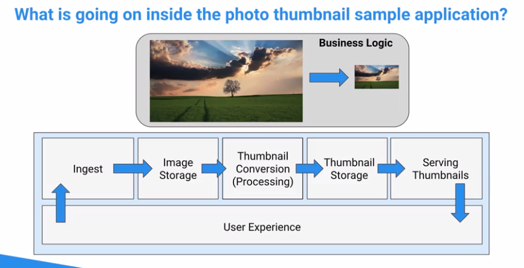
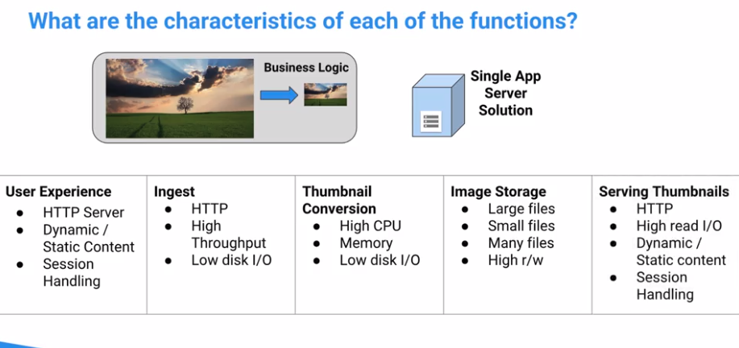
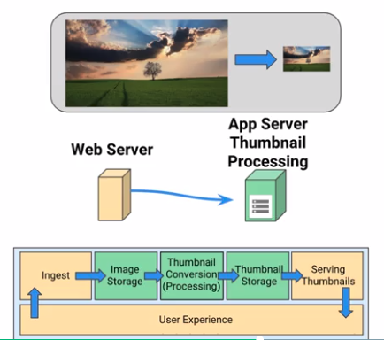
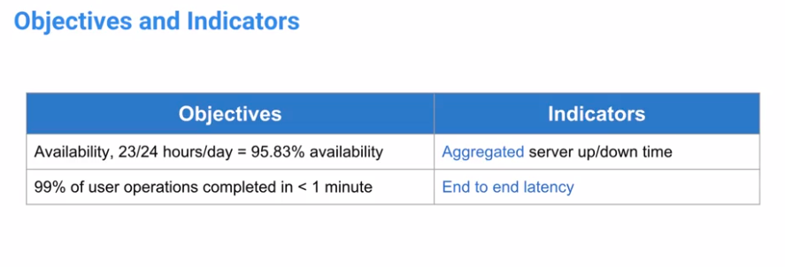

# Photo app

- what it does
    - convert images to thumbnales
    
# Photo Service is slow
### Systematic logical troubleshooting
1) segment and reduce the problem space
2) step through the system manually in your mine
3) add more monitoring or logging
    - intermittent failures can be caused by multiple simultaneous factors
    
### Colaboration and communications
- five whys
- being a hero can lead to longer downtime
- closed-group convos can cause confusion instead of coordination
- people are never root cause. thenking they are
    - stops analysis early
    - leads to fixing the wrong things
    

- segregate services for better performance and scalability
-business issue:
    - user experience is being impacted by the thumbnail conversion processing
- offloading high cpu process to another service
- reducing memory allocation on the web servers
- reduced some disk I/O
- moved image storage to the thumbnail processor

