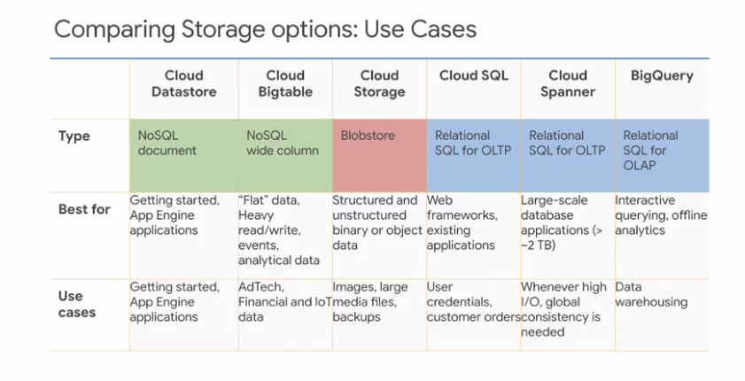
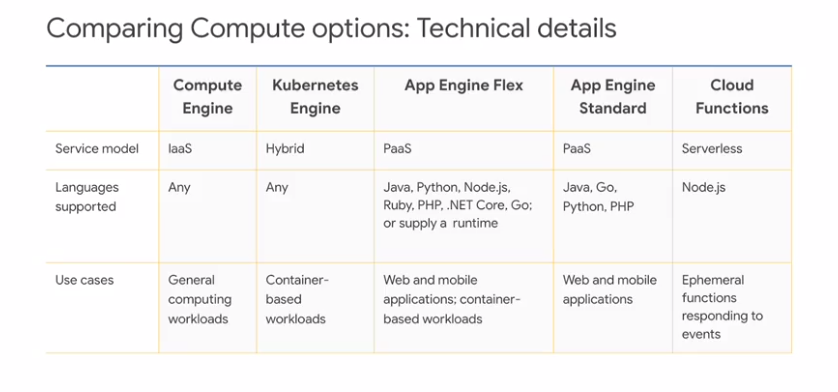

cloud.google.com/certification

- Sections of the professional Cloud Architect Exam
    - designing and planning a cloud solution architecture
    - managing and provisioning solution infrastructure
    - designing for security and compliance
    - analyzing and optimizing technical and business processes
    - managing implementation
    - ensuring solution and operations reliability

- agenda
    - understanding the professional cloud arch certification
    - sample case studies for the professional cloud architect exam
    - designing and implementing (review and prep tips)
    - operating and optimizing(review and prep tips)
    - resources and next steps  
    
- exam administration
    - length: 2 hours
    - not allowed to have
        - scratch paper
        - pen and notes
        - drinks
    - can take bathroom break, but time continues to count down 

- tips and tricks
    - draw on own personal experience
    - review exam guides
    - read case studies
    - take practice test
    - pace yourself, ther is timer
        - if concerned about time, run through exam and answer shortest easiest questions first
        - got back to 
            - ones that are more difficule
            - ones with multiple answers (no partial credit) 
    - bookmark questions unsure about and return
        - can do iterative rounds        
                         
# Product and tech knowledge
- for each product know
    - what it does/why it exists
    - whats special about its design, what purpose or purposes was it optimized
    - when do you use it, what are limits or bounds when it is time to consider an alt
    - what are key features of this product or technology
    - open source alt? benefits of using cloud based service over open source software?
    
### Designing a a solution infrascructure that meets technical requirement
- high availability and failover design
    - what are the real criteria?
    - what are the measurable goals?
- elasticity of cloud resources
    - how do you want the solution to behave when busy?
    - how will the system behave when under attack?
    - how will it behave when traffic diminishes
- scalability to meet growth requirements
    - scaling for growth is different from autoscaling to cover temp demand non-linearities.
    - when it is time to add a node, upgrade a service or switch services   
    
 ### Designing Nework, Storage, and Compute Resources
- exam outline and tips
    - integration w/ on premises/multi-cloud envs
        - when to use gsutil, gsutil rsync, and storage transfer service
    - cloud native networking (VPC, peering, firewalls, conainter networking
        - understand all the networking services and how to connect for throughput, security, billing and so forth
    - identification of data processing pipeline matching data characteristics to storage systems
        - velocity (how frequent)
        - volume (how much)
        - variety (format, structure)
        - volatility (how often does it change)
        - which services match?
    - data flow diagrams
        - very helpful to know where the data will travel through the solution and to look for bottlenecks and flow monitoring and control
    - storage system structure (e.g., Object, file, RDBMS, noSQL, newSQL
        - ACID - what is eventual consistency? BASE. Structure Requirements
    - mapping compute needs to platform products
        - scale, capacity, control/overhead   
- what transaction qualities are required
    - ACID
        - Atomicity
        - consistency
        - isolation
        - durability
    - BASE
        - basically availabile
        - Soft State
        - Eventual Consistency    
    
### Creating a migration Plan
- exam outline and tips
    - integrating solution with existing systems
        - parallel?
    - migrating systems and data to support the solution
        - how much, how to synchronize in both directions? where is the source of data truth?
    - licensing mapping
        - data center license to cloud license - may have diff license or requirements for licensed software
    - network and management planning
        - how will on premises connect to the cloud solution?
    - testing and proof of concept
        - different ways to divide a test audience: random, group, phased, test 
        
### Envisioning Future Solution Improvements
- exam outline and tips
    - cloud and tech improvements
        - when the tech improves, how will the solution embrace the improvements
    - business needs evolution
        - when the business changes, how will the solution change? most solutions don't just need to work once, they need to become self-sustaining
    - evangelism and advocacy
        - who are the gatekeepers and what do they need to know to effectively do their jobs?  

### configuring network topologies
- exam outline and tips    
    - extending to on-premises (hybrid networking)
        - vpn.
        - interconnect.
    - extedning to a multi-cloud env
        - interoperation interface. stackdriver (GCP+AWS)
    - security
        - discused in "designing for sec compliance"
    - data protection
        - encryption, access, CSEK, KMS
- subnets extend across zones
    - subnetworks can extend across zones in the same region
    - one vm and an alt vm can be on the same subnet but in diff zones
    - a single firewall rule can apply to both vms even though they are in diff zones    
- 5 ways to [interconnect](https://cloud.google.com/interconnect/)
- protect data by practicing defense in depth
    - edge protections
        - VM access/IP addresses
        - API access/endpoints
    - network protections
        - firewall is the first line of defense
    - infrastructure protections
        - isolation and controlled sharing of resources
        - server-side encryption and key management       
    
# Preparing for data processing
### configuring ind storage systems      
- exam outline and tips
    - data storage allocation
        - where will the data be located? resiliency? charges
    - data processing/compute provisioning
        - which platform? what capacity?
    - security and access management
        - CSEK and cloud storage
        - discussed in "designing for security compliance"
    - network config for data transfer and latency
        - location makes a diff in egress charges and round-trip time
    - data retention and data lifecycle management
        - what is nearline and coldline policy
        - when to delete data?
    - data growth management
        - when do you need a diff way to organize the data?
        - how much/how big will the current design support?

# Preparing for Compute
### Configure Compute Systems
- exam outline and tips
    - compute system provisioning
        - spped, throughput. capacity, burstiness?
        - turn off when not in use?
    - compute volatility configuration (preemptible vs standartd)
        - stateless vs. stateful
        - tolerance for lost data/state
    - network config for compute nodes
        - firewall rules, load balancing, NAT, VPN
    - orchestration tech config (e.g. Chef/puppet/ansible/terraform)
        - deployment manger ... others
        - value of self-documenting and automated orchestration of infrastructure
    - container orchestration (e.g. Kubernetes)
        - the value of container-based development
            - portability
            - scalability
            - fault isolation
            - platform agnostic deployment
            - CI/CD development methods

# Preparing for Security and Compliance
### Designing for Security
- exam outline and tips
    - IAM
        - use groups
    - Data Security (key management, encryption)
        - principle of least privilege 
    - Resource hierarchy (organizations, folders, projects)
        - separation of responsibilities to match organization structure
    - penetration testing
        - shape the scope and the objectives of the test
    - separation of duties
        - isolate key roles. always have an alt/secondary who can take over if needed
    - security controls
        - how are you monitoring security?
        - what logs and reports are availabile to you?
        - what responses will you take?
    - managing customer-supplied encryption keys w Cloud KMS
        - key management, key rotation, standards and policy compliance
- Identity and Access
    - seperate responsibilies
    - always have a backup or alt in case the responsibile person is unreachabile
    - have a separate maintenance path when the normal paths aren't working (e.g., bastion host)
    - use groups to allocate permisions, then separately manage group membership
    - customize roles for greater granularity of permissions
    - give each group only hte perms they need to perform the job or task
    - place critical funcs on service machines to create accountability trail (login log, activity monitoring)
    - backup/spare logs and records; have a review, analysis and monitoring strategy (ex: monthly reports)

### Designing for Legal Compliance
- exam outline and tips
    - Legislation (e.g., Health Insurance Portability and Accountability Act (HIPAA), Childrens Online Privacy Protection Act (COPPA), ect.)
        - PII - personally identifiable info
    - Audits (including logs)
        - do your policies conform to audit reqs
    - certification (e.g., Information Technology Infrastructure Library (ITIL) framework)
        - Firewall, IAM, and keys. CSEK?
        - make sure that grawoth doesnt break compliance

# Preparing for Analyzing Process
### Analyzing and defining technical processes
- exam outline and tips
    - Software Development Lifecycle Plan (SDLC)
        - [choosing developer tools on GCP](https://cloud.google.com/tools/docs/)
    - Continuous integration/continuous deployment
        - Kubernetes .. Container builder
    - troubleshooting/post mortem analysis culture
        - Blame isn't root cause
        - focus on systems
            - whay you can change in your procedures, now who is at fault
    - testing and validation
        - error budget vs. perfection
    - IT enterprice process (e.g., ITIL)
        - IT infrasturcture lib defines processes, skills and handoff of responsibiliteis
    - business continuity and disaster recovery
        - whats you data recovery story?
            - how do you know it works if you dont test it?
            - tradeoffs.
        - what are your SLAs
- testing
    - load testing - test overload conditions
    - plan and review production sLOs and SLIs
    - software development lifecycle plan (SDLC) to identify overload risks
    - analyze and define business processes including policy for degraded service and service outages
    - develop procedures to test resilience of solution in overload conditions
    - periodic testing
    - test recovery processes  
- optimizing VM cost
    - VM Dimensioning:
        - standard, high-CPU, high-mem, GPU, and custom
    - preemptible VMs
    - Sustained use discounts
        - machine-type discounts
        - inferred instance type discount
    - committed use discounts
        - compute engine and kubernetes
        - engine VMs
        - NOT: App Engine / Flex, DataProc, Dataflow, or Cloud SQL VMs
        
### Analyzing and defining business processes
- exam outline and tips
    - stakeholder management (e.g., influencing and facilitation)
        - who are the gatekeepers and what roles do they play?
        - how can you enable them to do their jobs?
    - change management
        - quality is a process, not product
        - change is inevitable in cloud
        - adapt process to be continuou
    - team assessment/skills readiness
        - do you need a playbook?
        - rehearsals?
    - decision-making process
        - How long do you have to make which decisions?
    - customer success management
        - how do you know that what you delivered is still meeting you customer/clients needs?
        - when is it time for version +1 or version 2.0?
    - cost optimization / resource optimization (Capex/Opex)
        - what are the financial goals and how are they measured and reported                 

# Preparing for Advising
### Advising Development operation teams
- exam outline and tips
    - application development
        - kubernetes, app engine, containers
    - API best practices
        - be familiar w the google cloud sdk and how it works for automating infrastrucutre. 
        - be familiar with ML APIs  such as Cloud Natural Language API
    - Testing frameworks (load/unit/integration)
        - be familiar w the different kinds of testing: black box/white box, unit, integration
        - be able to diff them
    - data and system migration tooling
        - especially be familiar w the features for migrating or synchronizing data between on-premises or non-GCP cloud and GCP

### Capacity planning for launch
- test first
- work through issues before serving user traffic
  - identify bottlenecks
- slow, staged, iterative
  - dark launches
  - use invitations to stage launch
